# Learn: context, GraphRAG, and how this demo works

> Generated from the Learn page's sources in `apps/web/src/learn` by `pnpm learn:export`. Don't edit it by hand: `pnpm learn:check` fails when it's out of date.

A hands-on course in how an agent uses context, how GraphRAG grounds answers in connected facts, and how every piece of this workbench fits together. Each lesson has a diagram, one key idea, a way to try it here, and links to go deeper.

## Contents

- [Part 1: Primer: context](#part-1-primer-context): What the model can see, and why it matters (3 lessons, 6 min)
  - [1.1 What context is](#11-what-context-is)
  - [1.2 Three layers of memory](#12-three-layers-of-memory)
  - [1.3 What goes wrong with context, and the defenses here](#13-what-goes-wrong-with-context-and-the-defenses-here)
- [Part 2: Primer: RAG and GraphRAG](#part-2-primer-rag-and-graphrag): Grounding answers in connected facts (3 lessons, 7 min)
  - [2.1 RAG in one page](#21-rag-in-one-page)
  - [2.2 GraphRAG](#22-graphrag)
  - [2.3 How this demo does GraphRAG](#23-how-this-demo-does-graphrag)
- [Part 3: Every concept in the demo](#part-3-every-concept-in-the-demo): Every moving part of the workbench (16 lessons, 20 min)
  - [3.1 The orchestrator agent](#31-the-orchestrator-agent)
  - [3.2 The workspace: focus, context, and records](#32-the-workspace-focus-context-and-records)
  - [3.3 The model: gpt-oss-20b on Workers AI](#33-the-model-gpt-oss-20b-on-workers-ai)
  - [3.4 Tools and the Model Context Protocol (MCP)](#34-tools-and-the-model-context-protocol-mcp)
  - [3.5 Salesforce: Agentforce agents, Hosted MCP, and Apex actions](#35-salesforce-agentforce-agents-hosted-mcp-and-apex-actions)
  - [3.6 Marketing Cloud Next: agent-built briefs, campaigns, and flows](#36-marketing-cloud-next-agent-built-briefs-campaigns-and-flows)
  - [3.7 Routing: policy router, intent router, and tool plans](#37-routing-policy-router-intent-router-and-tool-plans)
  - [3.8 Reliability guards for tool calling](#38-reliability-guards-for-tool-calling)
  - [3.9 Governance: permissions, confirmations, and kill switches](#39-governance-permissions-confirmations-and-kill-switches)
  - [3.10 Structured UI: Markdown, HXL cards, and native fallbacks](#310-structured-ui-markdown-hxl-cards-and-native-fallbacks)
  - [3.11 Observability: technical trace, turn history, and audit export](#311-observability-technical-trace-turn-history-and-audit-export)
  - [3.12 Evaluations](#312-evaluations)
  - [3.13 Campaign image workflow](#313-campaign-image-workflow)
  - [3.14 Campaign context: restaurant data and live weather](#314-campaign-context-restaurant-data-and-live-weather)
  - [3.15 The use-case library: marketing, sales, service, and financial services](#315-the-use-case-library-marketing-sales-service-and-financial-services)
  - [3.16 Long-term memory: remembering across chats](#316-long-term-memory-remembering-across-chats)
- [Glossary](#glossary)
- [Reference: every concept in the code](#reference-every-concept-in-the-code)

## Part 1: Primer: context

*What the model can see, and why it matters* · 3 lessons · 6 min

Everything a model knows during a turn is its **context**. Most agent quality problems, such as forgetting, hallucinating, or acting on stale facts, are context problems. This part explains what context is, how this demo manages it, and what can go wrong.

**You'll be able to**

- Name what fills a model's context window on every call
- Tell working memory, the audit trail, and long-term memory apart
- Spot the context failures the demo defends against

### 1.1 What context is

*The model only sees what is in its context window for this one call.*

**Diagram: What fills the context window**

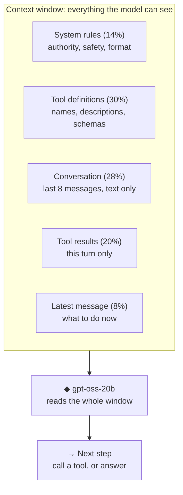

*One model call. Proportions are illustrative; the window is rebuilt from scratch every call.*

> **Key idea:** The model sees only what's in this call's window. Good context is the smallest set of high-signal facts for the next step.

A language model has no memory between calls. Each time the orchestrator asks the model for a turn, it sends a **context window**: a bounded sequence of tokens that is all the model can see. In this demo that window contains:

- **System instructions:** the orchestrator's rules, such as "Salesforce tool results are the only authority" and "never claim a write happened".
- **Tool definitions:** names, descriptions, and JSON input schemas for every tool the model may call on this step.
- **Conversation messages:** the recent user and assistant messages.
- **Tool results:** what each tool returned earlier in this turn.

**Context engineering** is deciding what goes into that window, in what form, and what stays out. More is not better. Long, noisy windows dilute attention ("context rot"), cost more, and give stale or injected text a chance to steer the model. Good context is the *smallest* set of high-signal information that lets the model do the next step well.

**Try it**

- Ask a question, then open its technical trace: “Summarize the sample campaign and its recent performance”

**In this demo**

- System prompt: apps/edge/src/turn-policy.ts (orchestratorSystemPrompt)
- Technical trace under each answer shows what the model did with its context

**Learn more**

- Guide: [Effective context engineering for AI agents (Anthropic)](https://www.anthropic.com/engineering/effective-context-engineering-for-ai-agents)
- Paper: [Lost in the Middle: How Language Models Use Long Contexts](https://arxiv.org/abs/2307.03172)
- Guide: [Building effective agents (Anthropic)](https://www.anthropic.com/engineering/building-effective-agents)

### 1.2 Three layers of memory

*Working memory, the audit trail, and long-term memory each live somewhere different.*

**Diagram: Three layers of memory**

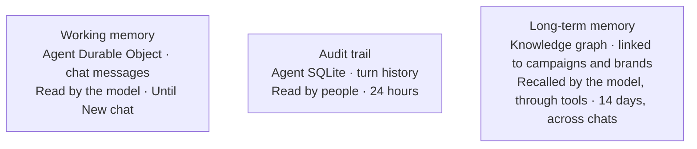

*Each layer has a different reader and lifetime. Only working memory is sent to the model every turn.*

> **Key idea:** “Session context” is three things: working memory for the model, an audit trail for people, and long-term memory by relationship.

"Session context" is really three different things with different lifetimes and owners:

| Layer | Holds | Lives in | Lifetime |
|---|---|---|---|
| **Working memory** | The current conversation, plus the workspace: the focus draft, open records, and context cards | Each user's agent Durable Object | Until **New chat** |
| **Audit trail** | What each turn did: route, tools, inputs and outputs, outcome | Agent SQLite (turn history) | 24 hours |
| **Long-term memory** | Drafts you asked to remember and confirmed Salesforce writes | Knowledge graph, linked to the campaigns and brands involved | 14 days, across chats |

**Working memory** is sent to the model as a bounded window: the last 8 messages. Earlier assistant replies are reduced to their text, so old tool results and reasoning never re-enter the prompt. The workspace is working memory too. The draft being built, the records the chat opened, and the context its tools gathered are summarized in every prompt, so the model works from structured state instead of re-reading old replies. See *The workspace* under the demo concepts.

**The audit trail** is never sent to the model. It exists for people: the History view and the audit export.

**Long-term memory** belongs in the graph because it's retrieved *by relationship* ("what did we decide about the Coastline push?"), not by recency, and it needs provenance. It's never sent automatically: the model reads it through recall tools, only when a question asks about earlier work. See *Long-term memory* under the demo concepts.

**Try it**

- Open turn history and memory (opens the history view)

**In this demo**

- History view: Turns (the audit trail) and Memory (long-term memory)
- apps/edge/src/orchestrator.ts (conversationWindow)
- packages/knowledge-graph/src/memory.ts

**Learn more**

- Guide: [Effective context engineering for AI agents (Anthropic)](https://www.anthropic.com/engineering/effective-context-engineering-for-ai-agents)
- Docs: [Cloudflare Durable Objects](https://developers.cloudflare.com/durable-objects/)
- Docs: [Cloudflare chat agents](https://developers.cloudflare.com/agents/api-reference/chat-agents/)

### 1.3 What goes wrong with context, and the defenses here

*Stale claims, prompt injection, and overflow, plus the guards this demo uses against each.*

**Diagram: Context risks and defenses**

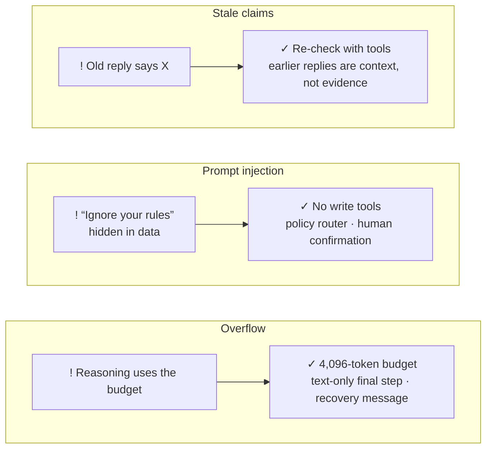

*Each risk has a defense that doesn't depend on the model behaving.*

> **Key idea:** Treat earlier replies and tool results as data, not instructions, and never let the model hold write tools.

**Stale or unsupported claims.** If an earlier answer said something wrong and it stays in the window, the model tends to repeat it as fact. Defense: earlier replies are *context, not evidence*. The system prompt requires re-checking Salesforce facts with tools each turn, and old tool results are stripped from history.

**Prompt injection.** Text inside data, such as a campaign description saying "ignore previous instructions", can try to steer the model. Defenses:
- The model has **no write tools**; writes need a human confirmation.
- A **policy router** answers write and forbidden requests without calling the model.
- Tool results are treated as data.
- The Apex readiness check flags instruction-like text.

**Overflow and truncation.** Workers AI defaults to 256 output tokens, which gpt-oss's reasoning could use up before any answer. Defenses: an explicit 4,096-token budget, forced text-only summary steps, and a recovery message if a turn still ends empty.

**Try it**

- Try a blocked request: “Publish and send the campaign”

**In this demo**

- apps/edge/src/turn-policy.ts (system rules)
- packages/contracts/src/index.ts (classifyPolicyIntent)
- Evaluations view: "No false write claims" check

**Learn more**

- Guide: [OWASP Top 10 for LLM Applications](https://owasp.org/www-project-top-10-for-large-language-model-applications/)
- Guide: [Effective context engineering for AI agents (Anthropic)](https://www.anthropic.com/engineering/effective-context-engineering-for-ai-agents)

### Check your understanding

Which of these does the model see on every turn?

1. The full turn history
2. The recent conversation and a summary of the workspace
3. Every earlier tool result, in full
4. The whole knowledge graph

<details><summary>Answer</summary>

**2. The recent conversation and a summary of the workspace** Models keep nothing between calls. Each turn sends the last 8 messages (text only) and a summary of the workspace: the draft in progress, open records, and context gathered. Turn history is for people, and the graph is queried through tools.

</details>

## Part 2: Primer: RAG and GraphRAG

*Grounding answers in connected facts* · 3 lessons · 7 min

**Retrieval-augmented generation (RAG)** grounds a model in data it was not trained on by retrieving relevant facts into its context. **GraphRAG** retrieves from a knowledge graph, so answers can follow relationships and show the path to their evidence.

**You'll be able to**

- Explain retrieve → augment → generate
- Say when a graph beats similarity search
- Describe how the demo's six graph tools return evidence paths

### 2.1 RAG in one page

*Retrieve relevant facts, add them to the context, then generate an answer grounded in them.*

**Diagram: Retrieval-augmented generation**

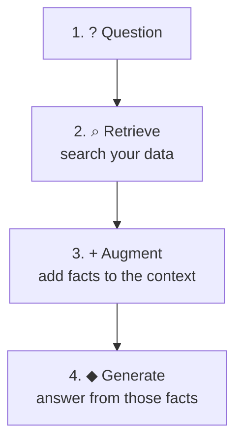

*Retrieval puts the right facts in the window before the model answers.*

> **Key idea:** RAG adds retrieved facts to the context so answers come from your data, not training.

Plain RAG has three steps:

1. **Retrieve.** Find the pieces of data most relevant to the question, usually by embedding text into vectors and running a similarity search.
2. **Augment.** Put those pieces into the model's context with the question.
3. **Generate.** The model answers from the retrieved facts instead of its training data.

RAG is excellent for "find the passage that answers this". It struggles when the answer depends on **connections** between facts spread across many documents. For example: *which accounts engaged with content from two campaigns and also lack SMS consent?* Similarity search finds similar text; it doesn't join facts.

In this demo, tool calls are a form of retrieval: the Salesforce agents and the graph tools fetch facts at answer time.

**Learn more**

- Paper: [Retrieval-Augmented Generation for Knowledge-Intensive NLP Tasks](https://arxiv.org/abs/2005.11401)
- Guide: [Building effective agents (Anthropic)](https://www.anthropic.com/engineering/building-effective-agents)

### 2.2 GraphRAG

*Retrieve connected facts from a knowledge graph and return the paths as evidence.*

**Diagram: An evidence path in the knowledge graph**

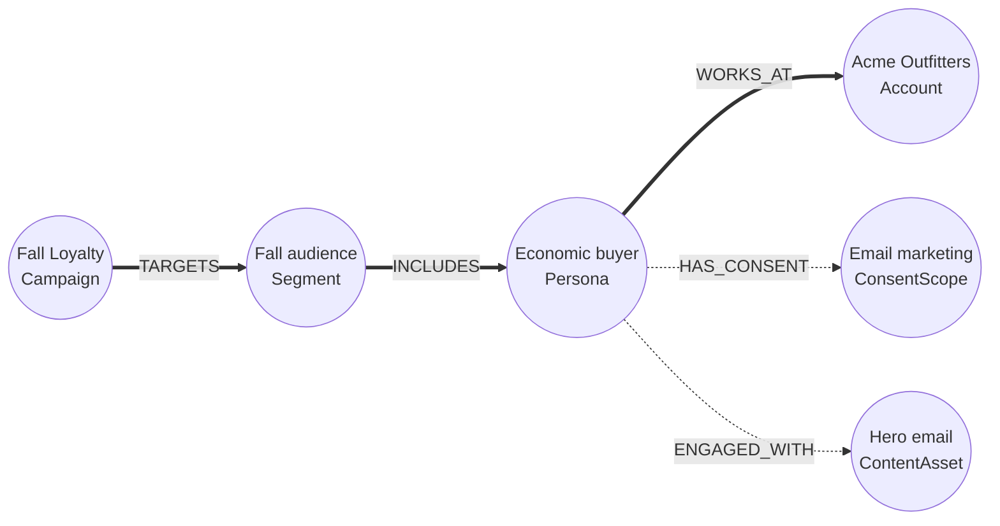

*Answering “why is Acme in the fall audience?” means following relationships. The highlighted path is the evidence.*

> **Key idea:** GraphRAG follows relationships, so an answer can join many facts and show the path that proves it.

A **knowledge graph** stores entities (**nodes**, such as a Persona, a Campaign, or a MenuItem) and typed **relationships** between them (`ENGAGED_WITH`, `TARGETS`, `FEATURED`). **GraphRAG** retrieves by traversing those relationships.

There are several common patterns:

- **Curated graph queries** (used here): the model picks from fixed, parameterized queries such as *explain buyer group*. This is predictable, safe, fast, and easy to evaluate.
- **Text-to-Cypher:** the model writes graph queries itself. It's flexible, but riskier and harder to govern.
- **Hybrid vector + graph:** vector search finds entry points, then graph traversal expands to connected context.
- **Community summaries:** Microsoft's GraphRAG clusters the graph into communities and pre-summarizes them to answer global "what are the themes?" questions.

GraphRAG's advantages are **multi-hop reasoning** and **explainability**. Every answer can carry the path that justifies it, which the demo shows in the **Graph evidence** panel.

**Try it**

- Explore the graph (opens the graph view)

**Learn more**

- Paper: [From Local to Global: A Graph RAG Approach (Microsoft Research)](https://arxiv.org/abs/2404.16130)
- Docs: [Microsoft GraphRAG project](https://microsoft.github.io/graphrag/)
- Guide: [What is GraphRAG? (Neo4j)](https://neo4j.com/blog/genai/what-is-graphrag/)
- Docs: [Neo4j GraphRAG for Python](https://neo4j.com/docs/neo4j-graphrag-python/current/)
- Docs: [Graph database concepts (Neo4j)](https://neo4j.com/docs/getting-started/graph-database/)

### 2.3 How this demo does GraphRAG

*Twelve read-only, curated graph tools over Neo4j, each returning evidence paths.*

**Diagram: The nine curated graph tools**

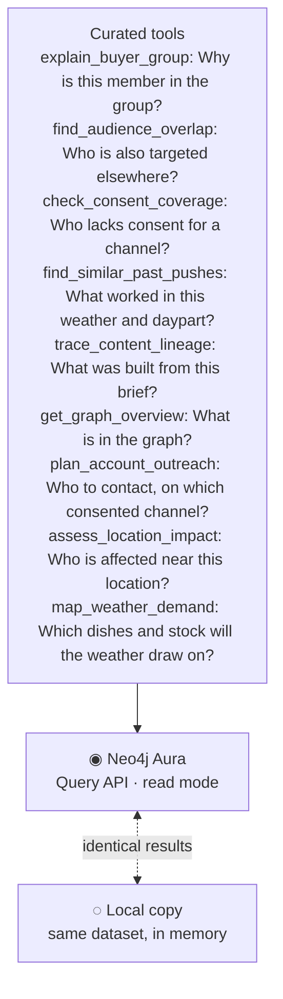

*Each tool is a fixed, parameterized Cypher query in read mode that returns an answer plus evidence paths.*

> **Key idea:** Nine curated, read-only queries, each returning evidence paths, with a local copy that must match Neo4j exactly.

- **The graph:** a deterministic, fictional dataset of about 2,400 nodes and 20,300 relationships. **Northstar** is the parent brand, with B2B accounts (each with a headquarters country), buying-role personas, campaigns, segments, content, brand rules, and consent scopes. **Coastline Kitchen** is a restaurant brand under Northstar: its locations, menu, and dayparts come from the restaurant system with the same ids. Its campaigns run on the **mobile app** and **email** channels. Each of its 1,500 past push sends and 600 past email sends links to its campaign, its content (push or email), app segment, consent for that channel, location, daypart, weather, and featured menu item, so an email campaign learns from past emails and a push from past pushes. Each location's app segment holds **marketing consent per channel**: separate push, email, and SMS opt-in counts, because consent to one channel isn't consent to another. **Harborstone Wealth** is a wealth-management brand under Northstar: regulated content with its approval records and required disclosures, an embargoed acquisition with its release package, and institutional clients with their holdings, signals, advisors, and contacts.
- **The store:** Neo4j AuraDB, reached over the HTTPS **Query API**, because Workers can't open Bolt connections. Every tool query runs in **read access mode**, so the database itself rejects writes. The only writes are the server's fixed long-term memory statements, which keep to their own dataset.
- **The tools:** `explain_buyer_group`, `find_audience_overlap`, `check_consent_coverage`, `find_similar_past_pushes`, `trace_content_lineage`, `get_graph_overview`, three that power the sales and service use cases (`plan_account_outreach`, `assess_location_impact`, and `map_weather_demand`), and three for financial services (`match_news_to_approved_content`, `prepare_deal_release`, and `build_aum_account_plan`). Each returns an answer plus up to 25 **evidence paths**.
- **Parity:** every tool also has an in-memory implementation over the same dataset. `pnpm kg:parity` proves both return identical results, so local development and evals match production. It also reports tool latency; the median stays under 500 ms.
- **Grounding:** evaluations check that a graph answer names only accounts, people, campaigns, and menu items that appear in what the tools returned.
- **In a flow:** the restaurant push campaign calls `find_similar_past_pushes` to learn what worked before in the same weather and daypart, then passes that to the Salesforce content tool.
- **Graph explorer:** the Graph page's brand filter narrows the canvas to one brand's own nodes: a node counts as a brand's own when it's at least as close to that brand as to any other, walking loaded relationships without crossing through another brand. That's how Coastline Kitchen keeps its campaigns, locations, and shared channels and consent, without pulling in Northstar's B2B accounts through the parent brand.

**Try it**

- Ask a graph question: “Who should be in the buyer group for Acme Outfitters, and why?”
- Open the graph explorer (opens the graph view)

**In this demo**

- Use cases: Buyer-group recommendation, and Buyer-group outreach around local holidays
- Graph evidence panel under answers; “Knowledge graph · Neo4j” in Sources
- packages/knowledge-graph, apps/edge/src/knowledge-graph

**Learn more**

- Docs: [Cypher manual: introduction](https://neo4j.com/docs/cypher-manual/current/introduction/)
- Docs: [Neo4j Aura Query API](https://neo4j.com/docs/aura/connecting-applications/query-api/)
- Course: [Neo4j GraphAcademy (free courses)](https://graphacademy.neo4j.com/)
- Code: [Official Neo4j MCP server](https://github.com/neo4j/mcp)
- Guide: [Salesforce Agentforce + Neo4j (Neo4j Labs)](https://neo4j.com/labs/genai-ecosystem/genai-frameworks/salesforce-agentforce/)

### Check your understanding

Which question needs GraphRAG rather than plain vector RAG?

1. “Find the paragraph in the brief about the offer.”
2. “Which accounts engaged with two campaigns and lack SMS consent?”
3. “Summarize this email draft.”
4. “Translate the headline into Spanish.”

<details><summary>Answer</summary>

**2. “Which accounts engaged with two campaigns and lack SMS consent?”** It joins facts across accounts, campaigns, engagement, and consent: a multi-hop question. Similarity search finds similar text but can't follow relationships.

</details>

## Part 3: Every concept in the demo

*Every moving part of the workbench* · 16 lessons · 20 min

Each piece of the workbench, how it works, and where to see it.

**You'll be able to**

- Trace one chat turn from the browser to Salesforce and back
- Explain why routing and guards sit around the model
- Know where to look when something goes wrong

### 3.1 The orchestrator agent

*A stateful Cloudflare agent per user that runs each chat turn.*

**Diagram: How a turn travels through the system**

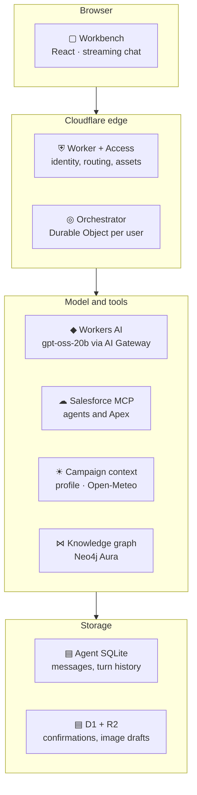

*The browser talks to one Worker behind Cloudflare Access; each user's orchestrator reaches the model and three MCP servers.*

> **Key idea:** One stateful agent per user runs each turn as a short tool loop and records every event.

The **orchestrator** is a Cloudflare **Agents SDK** chat agent running in a **Durable Object**: a single-threaded, stateful instance with its own SQLite storage.
- Each user gets their own instance, keyed by a hash of their Access identity and the workspace, so conversations and history are isolated by construction.
- Each turn streams to the browser over a WebSocket, and the stream is **resumable** if the tab reconnects.

A turn runs a **tool loop** of up to 6 steps. On each step the model either calls a tool or writes the answer. Its tools come from four MCP servers, connected per turn: Salesforce, campaign context, the knowledge graph, and external services (public holidays and weather alerts). The orchestrator decides which tools are available on each step (see *Routing*) and records a **turn trace** of every event.

Around the loop, the orchestrator also handles the events the model must not: it prepares confirmed writes and, once you confirm, asks Marketing Cloud's Campaign Creation agent to save the brief or create the campaign, then reads the records back. It checks Salesforce before and after the agent call, so a retry links what an earlier attempt saved instead of saving it twice. When the model refines a saved brief's preview, the orchestrator adds the Brief ID to the request if the model left it out. While a confirmed write runs, it publishes each step as agent state, which the browser receives immediately over the WebSocket, so the progress is live rather than a spinner until the end. For an inventory check, it keeps the forecast, the graph's demand map, and the stock counts as they arrive, computes which items are low, and rebuilds the system prompt for the answer step so the model presents exactly that list. It writes **long-term memory** when a write is read back or you ask it to remember a draft, and it reopens a memory into the workspace when you choose **Reopen**. The Worker's hourly job prunes the 24-hour audit and deletes memory past its 14 days.

**In this demo**

- apps/edge/src/orchestrator.ts
- “Behind the scenes · technical trace” under each answer

**Learn more**

- Docs: [Cloudflare Agents SDK](https://developers.cloudflare.com/agents/)
- Docs: [Cloudflare chat agents](https://developers.cloudflare.com/agents/api-reference/chat-agents/)
- Docs: [Cloudflare Durable Objects](https://developers.cloudflare.com/durable-objects/)
- Docs: [AI SDK: introduction](https://ai-sdk.dev/docs/introduction)
- Paper: [ReAct: Synergizing Reasoning and Acting in Language Models](https://arxiv.org/abs/2210.03629)

### 3.2 The workspace: focus, context, and records

*A per-chat, structured model of the work, built from tool results rather than model text.*

**Diagram: How the workspace is built and used**

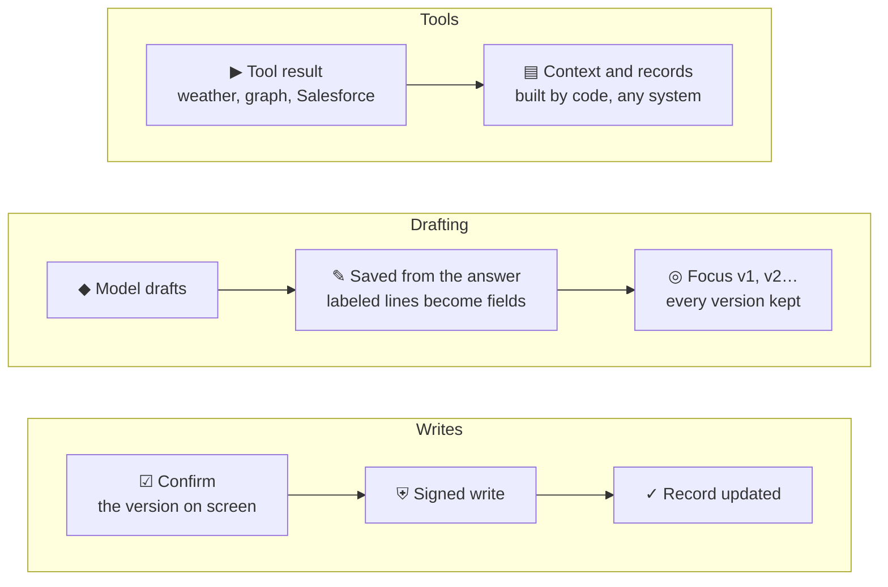

*Code turns tool results into context and records; the model drafts into the focus; confirmed writes act on the focus version shown.*

> **Key idea:** Tools fill the workspace, the model drafts into it, and confirmed writes act on exactly what it shows.

Each chat has a **working set**, shown in the Workspace panel and summarized in every prompt. It starts empty with **New chat** and has three parts:

- **Focus:** the draft being built as structured data: a title, labeled fields, a change note, and the context it was built from. A campaign's focus is the **brief** Marketing Cloud's Campaign Creation agent drafted, read field for field from the agent's reply (Key Message, Target Audience, Primary Goal, and so on). Other drafts, such as copy from the Content Builder agent, are read from the answer's labeled lines. Each revision becomes a new version, and earlier versions stay viewable. Once saved, the focus shows the brief's campaign preview and then the campaign and flow Salesforce read back.
- **Context:** cards for what tools returned, such as weather, forecasts, weather alerts, public holidays, the Federal Reserve's latest rate decision, store inventory, the inventory risk the workbench computed, the restaurant profile, graph evidence, remembered work recalled from memory, and Salesforce summaries, each with its source and fetch time.
- **Records:** records the chat opened, created, or updated, in any connected system, plus any reopened from memory, which are marked *Remembered* until the chat reads them again. Salesforce is one system and restaurant data is another; any system can join through the same reference: system, object type, and id.

Four properties make it trustworthy:

1. **Deterministic ingestion.** Cards and records come from tool results through code, never from model-written text, so nothing in the workspace is invented.
2. **Open versus available.** Records the connected systems make available are listed separately as a catalog, so the model never acts on a record the chat hasn't opened.
3. **Approvals come to you.** When something needs your approval, an **action card** appears in the chat: saving the brief in Marketing Cloud, then creating its campaign, or requesting a review after a readiness check. Accepting it prepares the confirmation card, with Salesforce's permission check.
4. **Writes act on what you see.** Saving asks the Campaign Creation agent to save exactly the focus version on screen. The confirmation records that version in its request hash, and the Brief, Campaign, and flow appear in Records as Salesforce read them back.

**Try it**

- Draft an email and watch the workspace fill: “Draft an email campaign for Coastline Kitchen, our fast casual restaurant in California, tailored to the current weather, time of day, and our menu”

**In this demo**

- Workspace panel: Focus, Records, and Context
- apps/edge/src/working-set.ts, apps/edge/src/focus.ts
- Issue #46: session working set

**Learn more**

- Guide: [Effective context engineering for AI agents (Anthropic)](https://www.anthropic.com/engineering/effective-context-engineering-for-ai-agents)
- Guide: [Writing effective tools for agents (Anthropic)](https://www.anthropic.com/engineering/writing-tools-for-agents)
- Guide: [Building effective agents (Anthropic)](https://www.anthropic.com/engineering/building-effective-agents)

### 3.3 The model: gpt-oss-20b on Workers AI

*An open-weight reasoning model served at the edge, chosen by evaluation.*

**Diagram: The model and its known quirks**

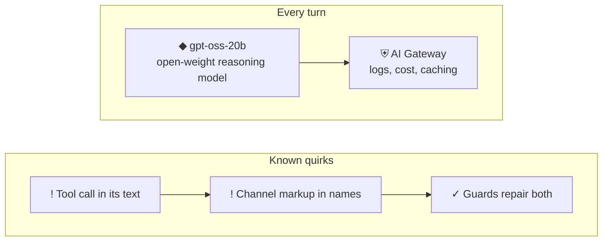

*The quirks are predictable, so each one has a targeted guard.*

> **Key idea:** The model was chosen by measuring the whole pipeline, and its known quirks shaped the guards.

The orchestrator runs **gpt-oss-20b**, OpenAI's open-weight reasoning model, on **Cloudflare Workers AI**, routed through **AI Gateway** for logging and cost visibility. The model ID is set in exactly one place: `PROOF_DEFAULTS.orchestratorModel`.

- **Why 20b:** after the routing and reliability fixes, it matched or beat gpt-oss-120b through the pipeline at about 60% of the latency and lower cost (see *Evaluations*).
- **Its quirks** shaped several guards. It sometimes writes a tool call into its reasoning or answer text instead of calling the tool, and leaks its internal "harmony" channel markup into tool names.

**Try it**

- See the model comparison (opens the evaluations view)

**In this demo**

- packages/contracts/src/index.ts (PROOF_DEFAULTS)
- Evaluations view: model comparison
- docs/decisions/ADR-005

**Learn more**

- Docs: [gpt-oss-20b on Workers AI](https://developers.cloudflare.com/workers-ai/models/gpt-oss-20b/)
- Code: [openai/gpt-oss](https://github.com/openai/gpt-oss)
- Guide: [The harmony response format (OpenAI Cookbook)](https://cookbook.openai.com/articles/openai-harmony)
- Docs: [Cloudflare Workers AI](https://developers.cloudflare.com/workers-ai/)
- Docs: [Cloudflare AI Gateway](https://developers.cloudflare.com/ai-gateway/)

### 3.4 Tools and the Model Context Protocol (MCP)

*A standard way for agents to discover and call tools, and the three MCP servers here.*

**Diagram: How MCP works**

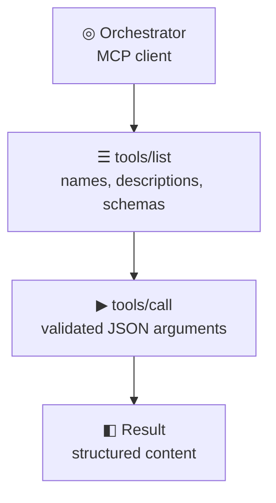

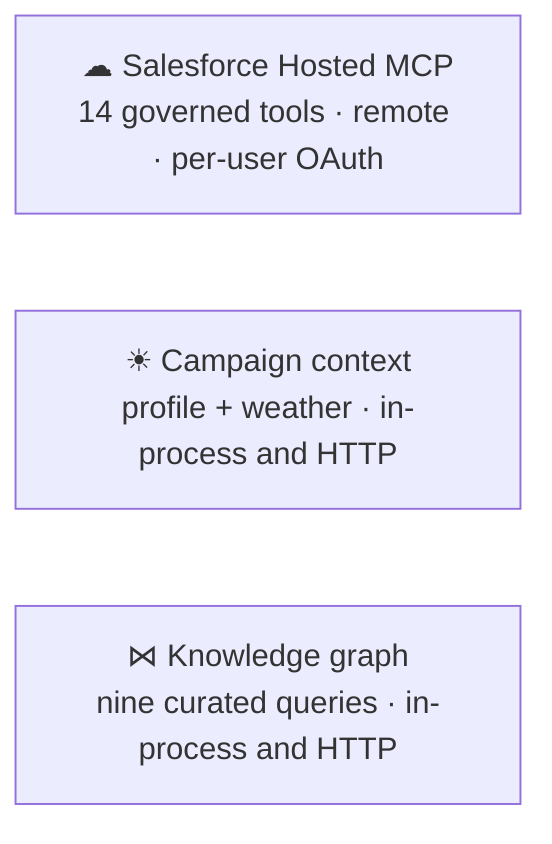

*Clients discover tools with tools/list and run them with tools/call; the transport can be HTTP or in-memory.*

> **Key idea:** MCP lets any agent list and call tools the same way, whether the server is remote or in-process.

**Tool calling** lets a model ask the host to run a function with structured arguments and get the result back. **MCP** standardizes this: a server advertises tools (a name, a description, and a JSON Schema for input), and clients list and call them over a transport such as streamable HTTP.

The demo uses four MCP servers:

| Server | Tools | How it's reached |
|---|---|---|
| **Salesforce Hosted MCP** | 14 governed tools backed by Agentforce agents and Apex actions | Remote, with per-user OAuth |
| **Campaign context** | Restaurant profile and store inventory (both mocked), and live weather and forecasts (Open-Meteo) | In-process; also at `/mcp/campaign-context` |
| **External services** | Public holidays (Nager.Date) and weather alerts (National Weather Service), both free public APIs | In-process |
| **Knowledge graph** | Nine curated Neo4j queries, plus three memory recall tools in chat | In-process; also at `/mcp/knowledge-graph` |

The local servers are called **in-process** through an in-memory MCP transport. The orchestrator uses the real protocol without a network hop, and external MCP clients can still reach the same servers over HTTP, behind Cloudflare Access.

**In this demo**

- Sources list in the left rail
- apps/edge/src/campaign-context, apps/edge/src/knowledge-graph
- salesforce/…/mcpServerDefinitions

**Learn more**

- Docs: [Model Context Protocol: introduction](https://modelcontextprotocol.io/docs/getting-started/intro)
- Spec: [MCP specification (2025-06-18)](https://modelcontextprotocol.io/specification/2025-06-18)
- Docs: [MCP on Cloudflare](https://developers.cloudflare.com/agents/model-context-protocol/)
- Guide: [Writing effective tools for agents (Anthropic)](https://www.anthropic.com/engineering/writing-tools-for-agents)
- Docs: [AI SDK: tools and tool calling](https://ai-sdk.dev/docs/ai-sdk-core/tools-and-tool-calling)

### 3.5 Salesforce: Agentforce agents, Hosted MCP, and Apex actions

*Salesforce is the system of record, and every Salesforce fact comes from its tools.*

**Diagram: Reads and writes in Salesforce**

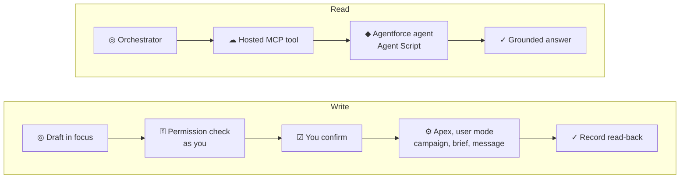

*Reads go through agents on Hosted MCP. Writes create or update real records through Apex actions, after a permission check and your confirmation.*

> **Key idea:** Salesforce is the system of record: drafts become real campaigns, briefs, and messages there, through Apex actions the model can't call.

Salesforce is **authoritative** for campaign data. The orchestrator never invents Salesforce facts. It calls tools on a **Salesforce Hosted MCP server**:

- **Agent-backed tools.** Each calls an **Agentforce** agent defined as an Agent Script bundle. Under every answer, **Salesforce agents** shows which agent handled each call, its type and template, its subagent, and the actions it ran.
  - **Northstar Campaign Creation** (a Marketing Cloud Next Campaign Creation agent) drafts, saves, and refines briefs and creates campaigns and their flows. See *Marketing Cloud Next*.
  - **Northstar Content Builder** (a Marketing Cloud Next Content Builder agent) drafts copy and content sections with the standard Draft Content and Create Section actions.
  - **Northstar Account Discovery** uses Marketing's account discovery and scoring APIs for signals, engagement, and buyer groups.
  - **Campaign Readiness and Governance** is a custom agent whose Apex actions summarize a campaign and check readiness, consent, and brand rules. These stay custom on purpose: Marketing Cloud Next has no campaign-summary or readiness action, and its standard **Generate Campaign Insights** flow fails in this org until campaigns have sent and gathered engagement data.
- **Briefs and campaigns** are created only by the Campaign Creation agent's standard actions, as Marketing Cloud's own **Brief**, **BriefPlanStep**, **Campaign**, and campaign **flow** records. The workbench has no custom objects or Apex for them.
- **Other writes:** a review task, an image attachment, and an inventory case for a store manager are global **Apex invocable actions** that verify a signed confirmation.
- **Permission check:** `check_write_access` is a read-only Apex action the workbench calls before preparing any write. It runs as the signed-in user and reports each permission it checked.

The model never holds a write tool: only the confirmation flow can call the write tools, and every write runs as you.

Metadata (Apex, fields, the permission set, and the MCP definition) deploys through a gated CI pipeline to one approved proof org.

**Try it**

- Check campaign readiness: “Check the sample campaign readiness and explain every blocker”

**In this demo**

- Use cases: Campaign performance summary, Launch readiness and review request
- “Salesforce agents” under each answer
- salesforce/force-app/main/default/aiAuthoringBundles, salesforce/force-app/main/default/classes
- docs/salesforce-deployment-pipeline.md

**Learn more**

- Docs: [Salesforce Hosted MCP servers reference](https://developer.salesforce.com/docs/platform/hosted-mcp-servers/guide/servers-reference.html)
- Course: [Introduction to Agentforce (Trailhead)](https://trailhead.salesforce.com/content/learn/modules/introduction-to-agentforce)
- Guide: [Salesforce Agentforce](https://www.salesforce.com/agentforce/)

### 3.6 Marketing Cloud Next: agent-built briefs, campaigns, and flows

*The workbench asks Salesforce's Campaign Creation agent to create briefs and campaigns, the way the Marketing app does.*

**Diagram: How a campaign is created in Marketing Cloud Next**

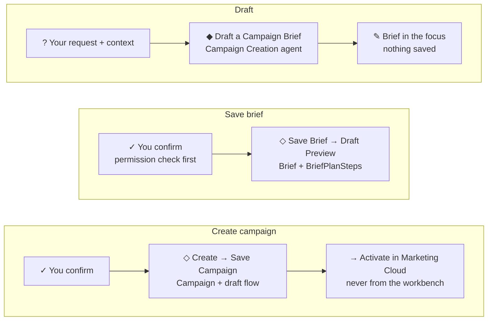

*Every record is created by the Campaign Creation agent's standard actions, after you confirm; the workbench reads each one back.*

> **Key idea:** Salesforce's Campaign Creation agent creates the brief, the campaign, and its flow; the workbench asks it to, after you confirm, and reads the result back.

In **Marketing Cloud Next**, a campaign starts as a **brief** and becomes a **campaign with a flow**. Salesforce's **Campaign Creation agent** does that work with standard actions, and the workbench asks it to rather than writing records itself.

**The agent.** `Northstar_Campaign_Creation` is an Agent Script agent built from Salesforce's `MktCloud__CampaignCreationAgent` template and published as a Campaign Creation agent. Only Agent Script agents can be exposed as Hosted MCP tools, so the workbench reaches it through the `NorthstarMarketingWorkbench` MCP server. Its **Marketing Campaigns** subagent runs the standard actions in Salesforce's required order:

| Step | Standard action | What it does |
|---|---|---|
| 1 | Draft a Campaign Brief (`MktCloud__GenerateBrief`) | Drafts name, description, key message, audience, goal, CTAs, KPI, guardrails, and priority. Saves nothing. |
| 2 | Save Campaign Brief (`saveBrief`) | Creates the **Brief** record. |
| 3 | Draft a Campaign Preview (`MktCloud__GenerateCampaignFromBrief`) | Plans the messages as **BriefPlanStep** records on the brief: channel, wait, subject, preheader, and body. |
| 4 | Create Campaign (`createCampaign`) | Creates the **Campaign**, linked to the brief. |
| 5 | Save Campaign (`MktCloud__SaveCampaign`) | Builds the campaign's **flow** from the preview, as a draft. |

Its **Campaign Refinement** subagent runs **Refine Campaign Preview** to change a saved preview ("make the second email shorter").

**How the workbench uses it.**
1. A campaign request (the Coastline plan, or "create a campaign in Marketing Cloud") ends with `draft_campaign_brief`. The agent's brief becomes the workspace focus, field for field.
2. **Save brief** (an action card, then a confirmation card): `save_marketing_brief` asks the agent to run steps 2 and 3.
3. **Create the campaign** (a second card): `create_marketing_campaign` asks it to run steps 4 and 5.
4. After each write, `get_marketing_records` (read-only Apex) reads the Brief, its steps, the Campaign, and the flow back from Salesforce. The workspace shows only what Salesforce returned, never the agent's say-so.

**What stays in Marketing Cloud.** The flow is created as a draft. Choosing its audience and sender, and activating it, happen in Marketing Cloud; the workbench never sends or activates anything. Previews in this org plan email (and SMS) steps: a push request is recorded in the brief's guardrails.

**Safe to retry.** Marketing Cloud's save actions aren't idempotent, so the workbench checks Salesforce before asking the agent. If this exact save was sent before and never confirmed (say, it timed out after the agent saved), and Salesforce now shows that brief, the workbench links it instead of saving again; a brief with the same name from another chat is left alone. A brief that already has its campaign never gets a second one. If the agent call fails, it checks once more, since the agent may have saved before the timeout. Only when nothing is there does it ask you to try again.

**The server fills in what the agent needs.** When you change a saved brief, the workbench adds the Brief ID to the Refine Campaign Preview request if the model left it out. The model forgot it in half of the live evaluation runs, and the agent would otherwise have to guess which brief you meant.

**Each call is one request.** Hosted MCP agent tools take a single message, so each call carries everything the agent needs: the confirmed brief fields, or the Brief ID whose preview was confirmed. The agent is asked to include the record ids in its reply, and the read-back verifies them.

**Try it**

- Draft the Coastline Kitchen email: “Draft an email campaign for Coastline Kitchen, our fast casual restaurant in California, tailored to the current weather, time of day, and our menu”
- Create a campaign in Marketing Cloud: “Create a campaign in Marketing Cloud for Coastline Kitchen's late-night tacos”

**In this demo**

- Use cases: Weather-aware campaign in Marketing Cloud
- “Salesforce agents” under each answer, and the confirmation card's agent details
- Workspace focus: Brief saved, campaign preview, Campaign and flow links
- salesforce/force-app/main/default/aiAuthoringBundles/Northstar_Campaign_Creation
- apps/edge/src/marketing-writes.ts

**Learn more**

- Docs: [Agentforce in Marketing Cloud Next (Salesforce Help)](https://help.salesforce.com/s/articleView?id=mktg.mktg_einstein_copilot_in_mc.htm&language=en_US&type=5)
- Course: [Create and customize a marketing campaign with Agentforce (Trailhead)](https://trailhead.salesforce.com/content/learn/modules/ai-in-marketing-cloud-next/create-and-customize-a-marketing-campaign-with-agentforce)
- Docs: [Expose Agentforce agents as Hosted MCP tools (Salesforce Developers)](https://developer.salesforce.com/docs/platform/hosted-mcp-servers/guide/agentforce.html)

### 3.7 Routing: policy router, intent router, and tool plans

*Deterministic decisions before and around the model.*

**Diagram: How a message is routed**

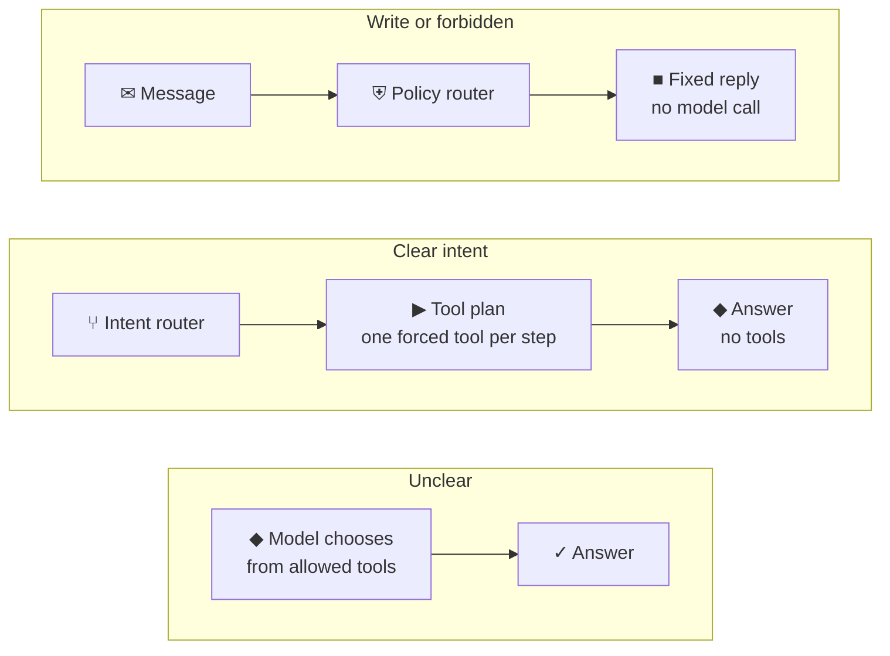

*Two deterministic routers run before the model. Forced tools come one per step, then the model answers with no tools.*

> **Key idea:** Deterministic routers decide what must never be left to chance; the model handles the rest.

Not every decision should be left to the model. Each turn passes through two deterministic routers:

1. **Policy router.** "Remember this draft" is handled by the server, which stores the focus in long-term memory. A save or create request with a draft in the workspace prepares that write: the server plans it from the draft, Salesforce checks your permissions, and a confirmation card appears. Other save, create, or change requests get a fixed reply pointing to the confirmation flow. Publish, send, delete, and similar requests are refused. A question about what to send ("What can we send clients?") asks for guidance, not an action, and reaches the model; each sentence that names an action is judged on its own, so context before the question ("The Fed moved rates.") doesn't turn it into a request. None of these calls the model, so it can never claim a write happened.
2. **Intent router.** Clear intents force a **tool plan**: an ordered list of tools, one forced per step.
   - "Check readiness" → `check_campaign_readiness`
   - "Why is X in the buyer group?" → `explain_buyer_group`
   - "What did we decide about…?" or "last time…" → `recall_decisions`; "what have we worked on recently?" → `recall_recent_work`
   - Outreach to an account's buyer group → `plan_account_outreach` → `get_public_holidays` for the account's country
   - Weather alerts or storms near a location → `get_weather_alerts` → `assess_location_impact`
   - Inventory, stock, or ingredients at a location → `get_weather_forecast` → `map_weather_demand` → `get_location_inventory`
   - Fed or interest-rate news and approved content → `get_fed_announcements` → `match_news_to_approved_content` for the event it maps to; market volatility → `match_news_to_approved_content` alone
   - An acquisition announcement → `prepare_deal_release`
   - An account plan, AUM, or a Harborstone client's plays → `build_aum_account_plan`
   - A Coastline Kitchen email or push campaign → profile → weather → past sends on that channel → the Campaign Creation agent's brief, which becomes the focus
   - "Create a campaign … in Salesforce" or "in Marketing Cloud" → the Campaign Creation agent's brief, then the save is prepared for confirmation
   - A change to a brief ("make it warmer") → back to the agent: a re-drafted brief before it's saved, or **Refine Campaign Preview** after
   - A change to other drafts → no tools; the model rewrites the draft, which is saved as the next version
   - The rules need specific signals and **defer to the model** when unsure, because a wrongly forced tool can't be undone within the turn.

After a plan finishes, the model gets **no tools** and must write the answer.

**Try it**

- See each turn's interpretation (opens the history view)

**In this demo**

- apps/edge/src/turn-policy.ts
- Turn history: “Interpretation” for each turn

**Learn more**

- Guide: [Building effective agents (Anthropic)](https://www.anthropic.com/engineering/building-effective-agents)
- Guide: [Writing effective tools for agents (Anthropic)](https://www.anthropic.com/engineering/writing-tools-for-agents)

### 3.8 Reliability guards for tool calling

*How the demo keeps a small model's tool calls on track.*

**Diagram: Tool-call failures and their guards**

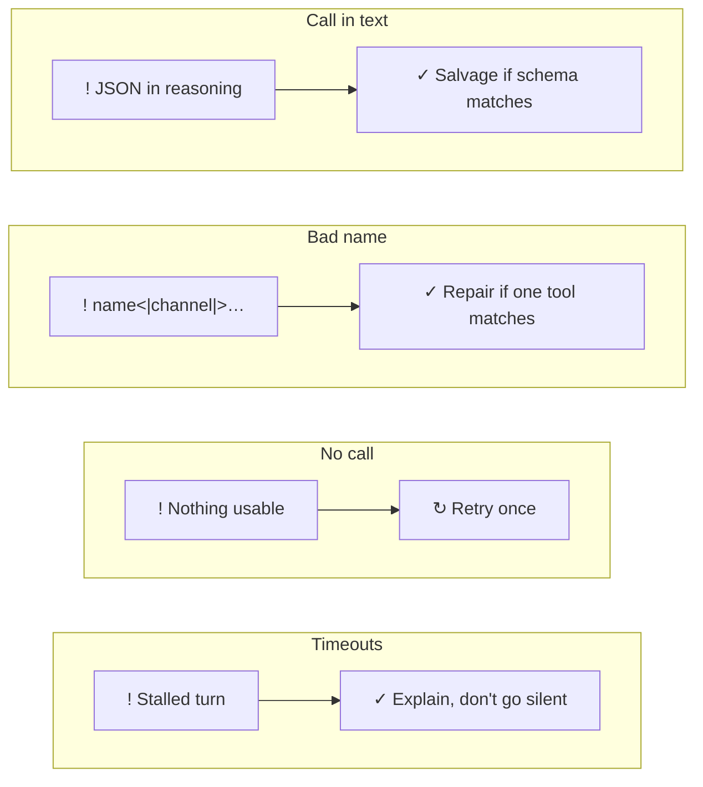

*The forced-tool middleware sits between the model and the tools.*

> **Key idea:** Small models fail at tool calls in predictable ways, so each failure mode gets a specific guard.

Small reasoning models fail at tool calling in predictable ways. The forced-tool guard, a language-model middleware, handles each one:

- **A tool call written into reasoning or answer text.** The guard recovers the JSON arguments when they match the tool's schema, and hides leaked text from the user.
- **Channel markup or a dropped prefix in tool names**, such as `summarize_campaign<|channel|>analysis`. The guard repairs the name when exactly one real tool matches.
- **Arguments that aren't valid JSON.** The guard escapes raw newlines inside strings and reads `<arg_key>`/`<arg_value>` markup. Arguments cut off mid-call can't be repaired, so they count as no call.
- **No usable call at all.** The step is retried once.
- **A tool call in an answer step,** which offers no tools. The call is dropped; if it was all the step produced, the answer is retried once.
- **Runaway reasoning.** Forced steps are capped at 2,048 tokens. Reasoning counts against the cap, and a detailed request to a Salesforce agent can take several hundred tokens on its own.

At the turn level:
- Structured timeouts cover the whole turn, gaps between chunks, and each tool call.
- Errors and empty answers become an explanatory message instead of a silent failure. When the Campaign Creation agent drafted a brief but the model wrote no reply, the answer is written from the brief's own fields.
- Workers AI capacity errors are explained in plain language.

**In this demo**

- apps/edge/src/forced-tool-middleware.ts
- apps/edge/src/turn-trace.ts
- Technical trace: “Recovery message added”

**Learn more**

- Docs: [AI SDK: tools and tool calling](https://ai-sdk.dev/docs/ai-sdk-core/tools-and-tool-calling)
- Guide: [The harmony response format (OpenAI Cookbook)](https://cookbook.openai.com/articles/openai-harmony)

### 3.9 Governance: permissions, confirmations, and kill switches

*Salesforce decides who may write, a person approves every write, and operators can turn things off.*

**Diagram: How a write is checked and confirmed**

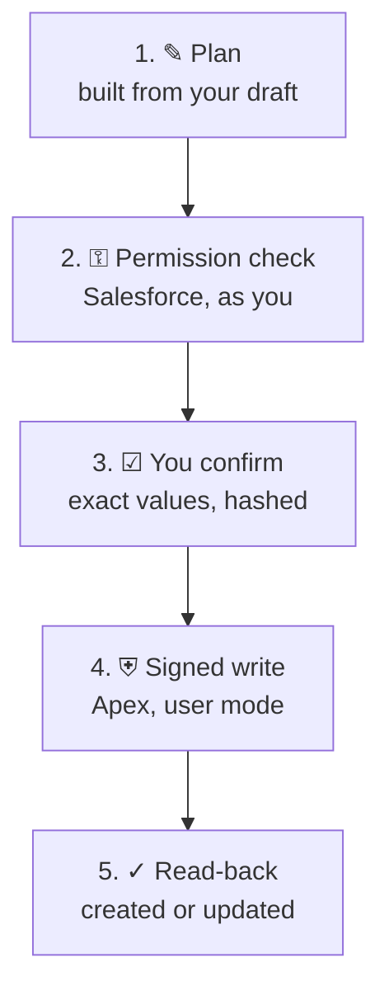

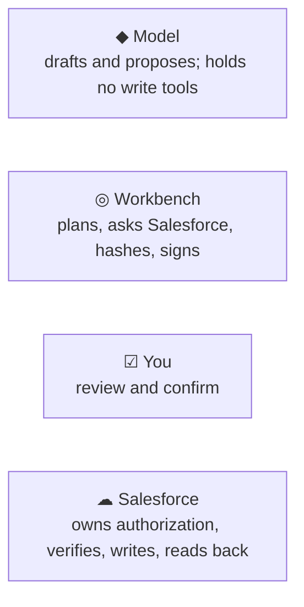

*Every write takes the same five steps. Salesforce checks your permissions before the card appears and again when the write runs; operators can also pause writes or tools without a deploy.*

> **Key idea:** Salesforce owns authorization: it checks your permissions before a write is prepared and again when it runs. A person confirms every write.

The workbench can have Marketing Cloud's Campaign Creation agent save a brief and create its campaign and flow, and it can create a review task or attach an image. Every write follows the same flow:

1. **Plan:** the server builds the request from the draft in the workspace, so the values are exactly what you reviewed. A review task or image targets a campaign this chat opened from Salesforce, never one it only reopened from memory.
2. **Permission check:** before anything is prepared, the workbench asks Salesforce, **as you**, whether you may make this write: the workbench permission set, the Marketing User feature for campaigns, create or edit access on each object, field-level security, and edit access to the record for updates. The confirmation card lists every check. If one fails, nothing is prepared and the card says why.
3. **Confirmation:** the card shows what will be created, its values, the draft version, and, for briefs and campaigns, the Marketing Cloud agent and the standard actions it will run. It's bound by a SHA-256 request hash and a 5-minute expiry, and it can be used once.
4. **Execute:**
   - For a **brief or campaign**, the workbench asks the Campaign Creation agent, through its Hosted MCP tool, to run its standard actions. The agent runs as you, so Salesforce enforces your permissions as each action runs.
   - For a **review task, image, or inventory case**, the Worker signs the confirmation with HMAC. Apex verifies the signature, the expiry, the same user, and the hash, then writes in **user mode**. An inventory case's contents come from the Worker, so its request hash is the SHA-256 of exactly those contents, and Apex re-hashes what it receives before writing.
5. **Read-back:** the workbench reads the records back from Salesforce (`get_marketing_records` for Marketing Cloud) and shows only what Salesforce returned. If the agent says it saved something that Salesforce doesn't show, nothing is shown as saved.

You watch both halves step by step. While a confirmation is prepared, the steps are the plan, Salesforce's permission check with how many checks passed, and binding the request to a one-time confirmation. While a confirmed write runs, they're the confirmation check, a look for an earlier attempt or the signing, the call to the agent or the Apex action, the read-back, and the memory record. A failure marks the step where it stopped and says why.

**Who checks what.** Each layer does one job:

| Layer | Responsible for | Not responsible for |
|---|---|---|
| **The model** | Drafting and proposing saves | Writing anything: it has no write tools |
| **The workbench** | Planning the request from your draft, asking Salesforce for a permission check, hashing, reading back | Deciding who may write, or creating briefs and campaigns itself |
| **The Marketing Cloud agent** | Running Marketing Cloud's standard actions for briefs, previews, campaigns, and flows | Deciding what to save: it saves what you confirmed |
| **You** | Reviewing exact values and confirming | — |
| **Salesforce** | Authorization (profile, permission sets, field-level security, sharing), signature checks for Apex writes, the records, and read-back | — |

**Kill switches** (`WRITES_ENABLED`, `DISABLED_TOOLS`, `MEMORY_ENABLED`) are Worker secrets that operators can flip without a deploy. Graph tools read in read-only mode; only the server's fixed memory statements write, and only to the memory dataset. The external-services tools only read public data (holidays, weather alerts, and Federal Reserve press releases) and send nothing about customers. No customer PII enters prompts, logs, or the graph.

**In this demo**

- Draft something → the Save to Salesforce action card in the chat → confirmation card with the permission check
- Check readiness → the Request a review action card → confirmation card
- Attach to campaign on a generated image
- infra/cloudflare/pot/README.md (operator runbook)

**Learn more**

- Guide: [OWASP Top 10 for LLM Applications](https://owasp.org/www-project-top-10-for-large-language-model-applications/)
- Guide: [Building effective agents (Anthropic)](https://www.anthropic.com/engineering/building-effective-agents)

### 3.10 Structured UI: Markdown, HXL cards, and native fallbacks

*Answers render as rich text, and records render as governed cards.*

**Diagram: How answers render**

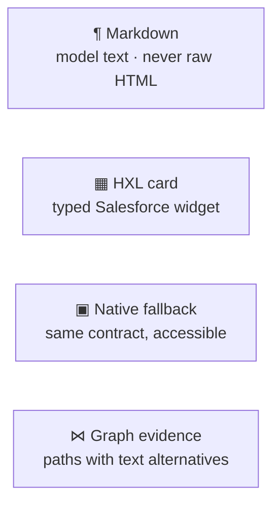

*Every surface has a safe, accessible rendering path.*

> **Key idea:** Model text renders as safe Markdown; records render as typed cards with accessible fallbacks.

- **Markdown answers.** The model may use concise Markdown. The UI renders it with `react-markdown`, which never renders raw HTML, so model output can't inject markup.
- **HXL cards.** Salesforce's HXL widgets (MCP Apps) let an agent action return a typed, interactive card, such as campaign readiness. When a host can't render HXL, the workbench shows an equivalent accessible **native fallback** built from the same contract.
- **Salesforce agents panel.** Under each answer that called Salesforce, a panel lists each call's agent, its type and template, the subagent, and the actions (with their flow or Apex targets) behind it. The confirmation card shows the same for the write it prepares.
- **Graph evidence panel.** Knowledge-graph paths render as directional chains, each with a text alternative for screen readers.
- **Live write progress.** Accepting an action card switches its button to **Preparing…** and shows the preparation's steps until the confirmation card appears. Clicking **Confirm** disables the buttons and shows the write's steps in the card as the Worker reports them, kept in view while they run. Afterwards a collapsible **Behind the scenes** record keeps each step and how long it took; it opens by itself when a write fails.
- **Inventory case confirmation.** The card lists the store manager, the forecast, and a table of each low item: on hand, needed, and the dishes it goes into. After you confirm, a banner links to the Case.
- **Use-case library.** A page of every scenario the demo runs, filterable by team, with its prompts, systems, and data flow. **Try it** puts a prompt in the chat box without sending it.
- **Accessibility.** The UI targets WCAG 2.2 AA and is tested in Chrome and Edge.

**In this demo**

- Workspace panel (readiness card with native fallback)
- apps/web/src/Markdown.tsx, apps/web/src/GraphEvidence.tsx

**Learn more**

- Docs: [HXL widgets for Agentforce action output](https://developer.salesforce.com/docs/platform/hxl/guide/agentforce-action-output.html)
- Code: [react-markdown](https://github.com/remarkjs/react-markdown)
- Guide: [WCAG overview (W3C)](https://www.w3.org/WAI/standards-guidelines/wcag/)

### 3.11 Observability: technical trace, turn history, and audit export

*See exactly what happened in every turn.*

**Diagram: Three ways to see what happened**

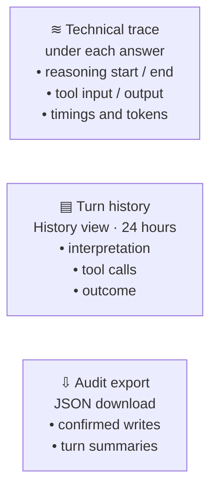

*Engineers read the trace; reviewers read history; auditors export it.*

> **Key idea:** Every turn leaves a trace for engineers and a history for reviewers.

- **Technical trace** under each answer: every lifecycle event in order, with timing.
  - turn start, step start and finish (finish reason, token counts)
  - reasoning start and end, with the model's reasoning, redacted
  - text start and end
  - tool input and output, with the Salesforce agent, subagent, and actions behind each Salesforce tool; errors; recovery messages; and the outcome, including when the answer was written from a tool's result because the model wrote none
  - the closing line gives the turn's total time with its **tokens** (input plus output, summed over the steps) and **tool calls**
- **Workers Logs** for operators: a Salesforce or agent call that failed is logged with its error and stack, even when the user sees a friendly message. A write or confirmation that failed logs the step where it stopped. Request content is never logged.
- **Turn history** (History → Turns): each utterance with the orchestrator's interpretation, the tool calls with inputs and results, and the outcome. Each row shows the turn's seconds beside its tokens and tool calls. Filterable, and kept 24 hours per user.
- **Memory** (History → Memory): what the workspace remembers across chats, with provenance, and **Reopen** and **Forget** buttons. The audit export lists each reopen. See *Long-term memory*.
- **Audit export:** a JSON download of the user's confirmed writes, memory remembers and forgets, and turn summaries.

**Try it**

- Open turn history (opens the history view)

**In this demo**

- Any answer → “Behind the scenes · technical trace”
- History view → Export audit (JSON)
- History view → Memory

**Learn more**

- Docs: [Cloudflare AI Gateway](https://developers.cloudflare.com/ai-gateway/)
- Guide: [Effective context engineering for AI agents (Anthropic)](https://www.anthropic.com/engineering/effective-context-engineering-for-ai-agents)

### 3.12 Evaluations

*Measure the whole pipeline across models, and publish the real results.*

**Diagram: What the evaluations measure**

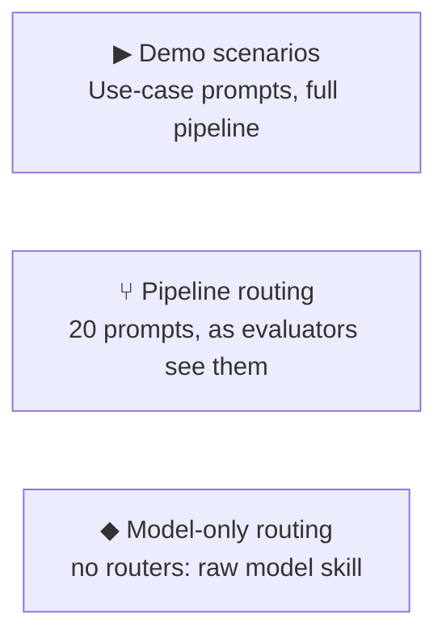

```mermaid
flowchart LR
  subgraph evaluations1_chips["Scores"]
    direction LR
    evaluations1_0["✓ Right tool or plan"]
    evaluations1_1["✓ Answered"]
    evaluations1_2["✓ No tool errors"]
    evaluations1_3["✓ No false write claims"]
  end
```

*Three suites run the production pipeline; every turn is scored on four checks.*

> **Key idea:** Evaluate the real pipeline, not just the model, and keep held-out prompts to catch overfitting.

`pnpm eval:live` runs the **production pipeline**: policy router, intent router, prompt, guards, and step settings, against live Workers AI models. Three suites:

- **Demo scenarios:** the use-case library's prompts, through the full pipeline.
- **Routing through the pipeline:** 28 prompts, including memory recall and the financial services use cases, as evaluators experience them.
- **Routing by the model alone:** the same prompts with no routers, isolating model quality.

Each turn is scored on:
- **right tool** (or the right plan in order)
- **answered**
- **no tool errors**
- **no false write claims**
- **graph-grounded:** a graph or memory answer names only accounts, clients, people, campaigns, content, menu items, and compliance approval IDs that its tools returned
- **agent request grounded:** a request to the Marketing Cloud Campaign Creation agent carries what the turn gathered. A brief request names the brand, a menu item, and the city or weather; a preview refinement names the saved Brief ID. It's scored on the request the agent actually receives.

Latency and tokens are recorded too, and the Evaluations view shows each turn's seconds with its tokens and tool calls, plus the mean tokens and tool calls per turn for each model. Runs recorded before the grounding check show no rate for it.

**What good looks like.** Pass/fail says the pipeline behaved; it doesn't say the answer was *good*. Each demo scenario has a written **rubric** in `packages/evals/src/rubric.ts`: a goal, an audience persona where a customer is involved, deterministic **criteria** (for the weather-aware Coastline campaign: names a menu item, uses the real weather and time of day, cites what worked before, a key message of 160 characters or fewer, a measurable KPI), and weights saying which quality dimensions matter. Criteria are reported as "criteria met" beside the pass gate, so pass rates stay comparable with earlier runs.

**Quantifying the qualitative.** A panel of two strong models from different families (GLM-5.3 and DeepSeek V4 Pro; a model never judges its own family) rates each answer 1 to 5 on anchored scales: context fidelity, accuracy, clarity, brand voice, engagement, marketer usefulness, and **would act**. For "would act" the judge answers as the audience persona on a standard purchase-intent scale, and the report shows the share of ratings that are 4 or 5 (the top-2-box). Ratings combine into a 0 to 100 **Quality Index** with a 95% bootstrap interval, and the report shows how often the two judges agree. Before a run is published, `pnpm eval:calibrate` has each judge score hand-written strong, mediocre, and weak answers and requires the right ordering. These are judge scores, not customer behavior: use them to rank models, not to forecast click rates.

**A fixed stand-in for the Marketing Cloud agent.** The real agent's copy doesn't depend on the orchestrator model, so every contestant would get the same canned text. In the run, one fixed reference model plays the agent, so what differs is what the orchestrator asked for (weather, time, menu, past results) and how it presents the result.

**Cost.** Every turn, judge call, and simulated-agent call is priced from Cloudflare's published Workers AI per-million-token rates (neurons are derived at $0.011 per 1,000). The run prints a projection first and refuses to start above `--max-usd`; the report shows cost per turn, cost per passing turn, and a cost-versus-quality chart. The expensive frontier models are opt-in with `--tier frontier`. Cloudflare limits paid frontier models to 20 requests a minute per model, so the runner throttles every call (turns, judges, simulator) per model, serves contestant turns before judge calls, and refreshes its sign-in token during long runs.

`pnpm eval` runs the routing set through the production policy and intent routers without a model, on every verify. Read-style Salesforce tools are fixtures in the live run, so the scores measure orchestration, not Salesforce agent quality. A held-out set of paraphrases guards the router against overfitting. The first published run found a real routing bug: any prompt mentioning "campaign" forced the summary tool.

**Try it**

- Open evaluations (opens the evaluations view)

**In this demo**

- Evaluations view
- scripts/run-live-evals.mjs, packages/evals

**Learn more**

- Guide: [Your AI product needs evals (Hamel Husain)](https://hamel.dev/blog/posts/evals/)
- Guide: [Building effective agents (Anthropic)](https://www.anthropic.com/engineering/building-effective-agents)

### 3.13 Campaign image workflow

*Generate reviewable variants, then attach one to Salesforce after confirmation.*

**Diagram: From concept to Salesforce file**

```mermaid
flowchart TB
  images0_0["✎ Concept<br/>PII and injection checks"]
  images0_1["◆ FLUX.2 klein<br/>1024 × 1024 draft"]
  images0_2["▤ R2 draft<br/>private, 7 days"]
  images0_3["☑ Confirm attach"]
  images0_4["✓ Campaign file<br/>hash checked by Apex"]
  images0_0 --> images0_1 --> images0_2 --> images0_3 --> images0_4
```

*Drafts stay private until a person confirms; Salesforce verifies the file hash.*

> **Key idea:** Generated images stay private drafts until a person confirms, and Salesforce verifies the file's hash.

**FLUX.2 klein** on Workers AI generates a 1024×1024 draft from a bounded prompt, with PII and injection checks on the concept.
- Drafts are stored privately in **R2** for 7 days, with provenance (model, prompt version, content hash) in **D1**.
- The variant gallery lets you select, reject, or revise.
- **Attach to campaign** runs the confirmation flow. Apex checks the PNG's SHA-256 against the confirmed hash, creates one Salesforce file on the Campaign, and reads back its checksum and link.

**In this demo**

- Workspace → Generate campaign visual (expand it) → Attach to campaign

**Learn more**

- Docs: [FLUX.2 klein 4B on Workers AI](https://developers.cloudflare.com/workers-ai/models/flux-2-klein-4b/)
- Docs: [Cloudflare R2](https://developers.cloudflare.com/r2/)
- Docs: [Cloudflare D1](https://developers.cloudflare.com/d1/)

### 3.14 Campaign context: restaurant data and live weather

*External context that makes a campaign draft specific to the moment.*

**Diagram: The Coastline campaign tool plan**

```mermaid
flowchart TB
  push_plan0_0["1. ☰ Restaurant profile<br/>menu, favorites, voice"]
  push_plan0_1["2. ☀ Current weather<br/>Open-Meteo, live"]
  push_plan0_2["3. ⋈ Past pushes<br/>knowledge graph"]
  push_plan0_3["4. ☁ Content draft<br/>Salesforce agent"]
  push_plan0_4["5. ◎ Workspace focus<br/>saved as version 1"]
  push_plan0_0 --> push_plan0_1 --> push_plan0_2 --> push_plan0_3 --> push_plan0_4
```

*Four forced tools in order: context, past results, then the content draft. The model presents the draft, and the workspace saves it as the focus.*

> **Key idea:** Outside context (menu, weather, past results) turns a generic draft into one that fits this moment.

The **campaign-context** MCP server gives the orchestrator facts Salesforce doesn't have:

- `get_restaurant_profile`: the restaurant system's own data for **Coastline Kitchen**, a fictional fast-casual brand under Northstar that is open 24/7: its five California locations, menu, favorites, dayparts, app audience with opt-ins **by channel** (push, email, SMS), brand voice, and promotion rules. Locations and menu items carry the same ids as their knowledge-graph nodes.
- `get_current_weather`: live conditions from **Open-Meteo**, which is free, keyless, and CC BY 4.0, for a California city.
- `get_weather_forecast`: Open-Meteo's daily forecast, with each day's demand-planning weather (heat, rain, fog, cloudy, or clear).
- `get_location_inventory`: a restaurant's stock from a randomized **store inventory** mock, with par levels and typical daily use from the menu's recipes. See *The use-case library*.

The Coastline campaign plan (email or push) chains these with the knowledge graph's past performance and the Salesforce content tool. The plan is **channel-aware**: the channel you ask for (or the draft's channel) is pinned on the past-performance lookup by the server, so an email campaign cites email opt-ins, never push opt-ins, whatever the model passed. The finished draft is saved to the workspace **focus**. The draft fits the menu, the time of day, the weather, and what worked before, and "make it warmer" revises it as a new version.

**Try it**

- Draft the Coastline Kitchen email: “Draft an email campaign for Coastline Kitchen, our fast casual restaurant in California, tailored to the current weather, time of day, and our menu”
- Draft the Coastline Kitchen push: “Draft a push notification campaign for Coastline Kitchen, our fast casual restaurant in California, tailored to the current weather, time of day, and our menu”

**In this demo**

- Use cases: Weather-aware campaign in Marketing Cloud (the push prompt)
- Sources: Restaurant data, Weather · Open-Meteo

**Learn more**

- Docs: [Open-Meteo API docs](https://open-meteo.com/en/docs)
- Docs: [Model Context Protocol: introduction](https://modelcontextprotocol.io/docs/getting-started/intro)

### 3.15 The use-case library: marketing, sales, service, and financial services

*Every scenario the demo runs, how data flows through it, the ones that reach beyond marketing, and three for a regulated industry.*

**Diagram: Sales and service use cases**

```mermaid
flowchart TB
  subgraph use_cases0_lane0["Sales"]
    direction LR
    use_cases0_0_0["? Account + time frame"]
    use_cases0_0_1["⋈ plan_account_outreach<br/>contacts · consent · country"]
    use_cases0_0_2["↗ Nager.Date<br/>public holidays"]
    use_cases0_0_3["✎ Dated outreach plan<br/>consented channels only"]
    use_cases0_0_0 --> use_cases0_0_1 --> use_cases0_0_2 --> use_cases0_0_3
  end
  subgraph use_cases0_lane1["Service"]
    direction LR
    use_cases0_1_0["? Location + concern"]
    use_cases0_1_1["↗ National Weather Service<br/>active alerts"]
    use_cases0_1_2["⋈ assess_location_impact<br/>audience · push reach · campaigns"]
    use_cases0_1_3["✎ Impact + drafted notice<br/>aggregate only"]
    use_cases0_1_0 --> use_cases0_1_1 --> use_cases0_1_2 --> use_cases0_1_3
  end
  subgraph use_cases0_lane2["Inventory"]
    direction LR
    use_cases0_2_0["↗ Open-Meteo forecast<br/>heat, rain, …"]
    use_cases0_2_1["⋈ map_weather_demand<br/>dishes · stock · manager"]
    use_cases0_2_2["▤ Store inventory<br/>randomized mock"]
    use_cases0_2_3["✎ Case for the manager<br/>after you confirm"]
    use_cases0_2_0 --> use_cases0_2_1 --> use_cases0_2_2 --> use_cases0_2_3
  end
  use_cases0_lane0 ~~~ use_cases0_lane1 ~~~ use_cases0_lane2
```

*A live outside service says what's happening; the knowledge graph says who or what it affects, and a confirmed write goes to Salesforce only when you approve it.*

> **Key idea:** Each use case pairs a live outside service with the graph: the service says what's happening, and the graph says who or what it affects: people and how to reach them, or dishes and the stock they draw on.

**Use cases** (in the left rail) lists every scenario the demo can run end to end. Each has the situation it's for, the prompts that drive it (with a **Try it** button), the systems involved, a step-by-step data flow, what the knowledge graph contributes, what it writes, and what to watch for. Drafted scenarios that aren't built yet are shown greyed out as *Coming soon*.

Two use cases take the same pattern beyond marketing. Each pairs a new free public API with the knowledge graph, and **the graph supplies the key element**.

**Sales: buyer-group outreach around local holidays.** "Plan outreach to Acme Outfitters' buyer group for the next month."
1. `plan_account_outreach` walks the graph from the account to its buying-role personas. For each person it returns their engagement, when they last engaged, and **the channels they have marketing consent for**, following Persona → HAS_CONSENT → ConsentScope → FOR → Channel. It also returns the account's headquarters country.
2. `get_public_holidays` asks **Nager.Date** for that country's upcoming public holidays.
3. The answer is a prioritized, dated plan that uses only consented channels and avoids the holidays. Nothing is sent or logged.

**Service: severe-weather customer impact.** "There are weather alerts near our San Diego location. Which customers are affected and what should we tell them?"
1. `get_weather_alerts` asks the **National Weather Service** for active watches, warnings, and advisories at the restaurant's coordinates. If there are none there, it lists alerts elsewhere in California.
2. `assess_location_impact` walks Location ← Segment → consent and Campaign → TARGETS → Segment. It returns how many app users are near the location, how many can be reached on each channel (push, email, SMS) under that channel's own consent, and which active campaigns target them and should be paused. The counts are aggregate; no individual customer is named.
3. The answer is an impact summary, a drafted customer notice, and a note for the store team. Nothing is sent or paused.

Both APIs are free and keyless, called live from the Worker through a new in-process **external services** MCP server. An API failure comes back as a tool error, and the answer says so instead of guessing.

**Service: weather-driven inventory check, with a case for the store manager.** "Check inventory for our Sacramento store against the forecast."
1. `get_weather_forecast` reads the daily **Open-Meteo** forecast and buckets each day for demand planning: **heat** for highs of 88°F or more, **rain** for wet days, otherwise fog, cloudy, or clear.
2. `map_weather_demand` walks WeatherCondition → **LIFTS_DEMAND** → MenuItem → **MADE_WITH** → InventoryItem, plus Location → **MANAGED_BY** → StoreManager. Each lift is learned from past push results: a dish's average order rate under that weather against its overall average, kept when it's at least 15% higher. Heat lifts the cold drinks and açaí bowl; rain and fog lift soup, noodles, and the burrito.
3. `get_location_inventory` reads the restaurant's stock from the **store inventory system**. In this demo it's a randomized mock that's stable within a day: on hand, par level, and typical daily use per item.
4. **Code, not the model, decides what's low.** For each weather-lifted item, the forecast need is typical daily use on each day, raised by the lift on the days whose weather lifts a dish made with it. An item is low when what's on hand won't cover that. The result becomes an **Inventory risk** card and an **action card**, and the answer step is told exactly this list.
5. Accepting the card prepares a **Salesforce case** for the store manager. The case contents are hashed, the hash becomes the confirmation's request hash, and after you confirm, the `create_inventory_case` Apex action re-hashes what it received and refuses anything that doesn't match. It then finds the manager's Contact by title and restaurant, creates the Case as you, and reads it back.

The graph and prompts carry the manager's name only, never contact details. Nothing is ordered.

**Financial services: Harborstone Wealth.** Three use cases (filter **Financial services**) show the graph in a regulated industry, where only content a registered principal approved can go out, exactly as approved, with its required disclosures. Harborstone is a fictional wealth-management brand under Northstar.
- **Market news to pre-approved content.** "The Fed just announced its rate decision. What pre-approved content can we send clients today?"
  1. `get_fed_announcements` reads the Federal Reserve's public press feed, finds the latest FOMC statement, and reads its rate decision: raise, lower, or maintain, the size, and the new target range. It maps the decision to a market event.
  2. `match_news_to_approved_content` walks MarketEvent ← **RESPONDS_TO** ← ContentAsset → **APPROVED_UNDER** → Approval and → **REQUIRES** → Disclosure. It returns what's ready to send, with approval IDs, expiry, and disclosures; what's blocked and exactly why (an expired approval, one still pending, or a **FAILED** compliance rule); reach per channel under marketing consent; and past responses, which show that sending within hours of the news opened far better than the next day.
  3. The answer never writes new regulated copy. Asking for a Marketing Cloud campaign hands the approved asset, its approval ID, and disclosures to the Campaign Creation agent's brief.
- **Acquisition announcement, released on time.** `prepare_deal_release` orders the embargoed package through **RELEASED_WITH** → Deal and checks each piece's audience through **ADDRESSED_TO** → Segment → **HAS_CONSENT**. Advisors get their FAQ first, then the press release, then client letters. The acquired firm's clients get service notices under their client agreement, never marketing, until they opt in, so an SMS that also failed its disclosure check is blocked for both reasons.
- **Account plan to grow assets under management.** `build_aum_account_plan` walks Client → **HAS_SIGNAL** → Signal → **SUGGESTS** → Product for products the client doesn't hold, sizes each play from the estimated assets held elsewhere, counts how many clients of the same type hold it, and finds its approved content through Product ← **EXPLAINS** ← ContentAsset. Each contact comes with the channel that has approved content they consented to, so the 30/60/90-day sequence never sends content on a channel it isn't approved for. "Activate the plan" drafts a Marketing Cloud brief from it.

**Try it**

- Plan buyer-group outreach: “Plan outreach to Acme Outfitters' buyer group for the next month”
- Assess a weather disruption: “There are weather alerts near our San Diego location. Which customers are affected and what should we tell them?”
- Check inventory against the forecast: “Check inventory for our Sacramento store against the forecast”

**In this demo**

- Use cases in the left rail
- Sources: Holidays · Nager.Date, Weather alerts · NWS, Rate news · Federal Reserve
- Workspace: Forecast, Store inventory, and Inventory risk cards, then the case action card
- apps/edge/src/external-services, apps/edge/src/inventory-risk.ts, apps/web/src/usecases

**Learn more**

- Docs: [Nager.Date public holiday API](https://date.nager.at/Api)
- Docs: [National Weather Service API (api.weather.gov)](https://www.weather.gov/documentation/services-web-api)
- Docs: [Open-Meteo API docs](https://open-meteo.com/en/docs)
- Docs: [Federal Reserve press release feeds](https://www.federalreserve.gov/feeds/feeds.htm)
- Docs: [FINRA Rule 2210: communications with the public](https://www.finra.org/rules-guidance/rulebooks/finra-rules/2210)
- Docs: [Model Context Protocol: introduction](https://modelcontextprotocol.io/docs/getting-started/intro)

### 3.16 Long-term memory: remembering across chats

*Drafts and decisions stored in the graph by the server, recalled by tools, and forgotten on request.*

**Diagram: How long-term memory is written, recalled, and forgotten**

```mermaid
flowchart TB
  subgraph long_term_memory0_lane0["Remember"]
    direction LR
    long_term_memory0_0_0["✓ Confirmed write or “remember this”<br/>read back from Salesforce"]
    long_term_memory0_0_1["⚙ Server writes fixed Cypher<br/>never the model"]
    long_term_memory0_0_2["◇ Draft · Decision nodes<br/>ABOUT campaigns and brands"]
    long_term_memory0_0_0 --> long_term_memory0_0_1 --> long_term_memory0_0_2
  end
  subgraph long_term_memory0_lane1["Recall"]
    direction LR
    long_term_memory0_1_0["? “What did we decide…?”"]
    long_term_memory0_1_1["⌕ recall_decisions<br/>workspace set by the server"]
    long_term_memory0_1_2["✓ Dated, sourced answer<br/>re-check Salesforce before reuse"]
    long_term_memory0_1_0 --> long_term_memory0_1_1 --> long_term_memory0_1_2
  end
  subgraph long_term_memory0_lane2["Forget"]
    direction LR
    long_term_memory0_2_0["× History → Memory → Forget"]
    long_term_memory0_2_1["⏱ Hourly sweep<br/>after 14 days"]
    long_term_memory0_2_0 --> long_term_memory0_2_1
  end
  long_term_memory0_lane0 ~~~ long_term_memory0_lane1 ~~~ long_term_memory0_lane2
```

*The server writes memory on events it verified; the model can only recall it, for this workspace, and must re-check Salesforce.*

> **Key idea:** The server remembers what you confirmed; the model only recalls it, dated and sourced, and re-checks Salesforce before reusing it.

A new chat starts with an empty workspace, but some work should outlive it: the draft you settled on, the campaign you saved, the review you asked for. **Long-term memory** keeps these in the knowledge graph for 14 days, shared by the workspace.

**What gets remembered, and by whom.** The model never writes memory. The server does, only on events it has verified:
- a Salesforce save, review task, or image attachment that you confirmed and Salesforce read back
- a request to remember the draft in focus: say "remember this draft", or use **History → Memory**

**How it's stored.** Each memory is a small subgraph in its own dataset, next to the demo graph:
- a `Draft` node per version, linked to the version it replaced (`SUPERSEDES`)
- a `Decision` node, linked to the draft it saved (`DECIDED_ON`) and the Salesforce record it created (`RECORDED_IN`)
- `ABOUT` links to the `Campaign` and `Brand` nodes involved, so "what did we decide about Coastline?" is a graph question

Every node carries its workspace and an expiry. The person who acted is stored only as a hash.

**How it's recalled.** When you ask about earlier work ("what did we decide…", "last time…", "what have we worked on recently?"), the intent router forces a recall tool:
- `recall_decisions`
- `recall_recent_work`
- `explain_memory`

The server gives these tools the workspace, so the model can't read another workspace's memory. Each item comes back **dated and sourced**, with provenance paths, and the model is told to treat it as past work and re-check Salesforce before reusing it.

**How it's reopened.** **Reopen** in the Memory tab puts remembered work back into the current chat:
- A remembered draft becomes the focus again, at its remembered version, with a note saying where it came from.
- For a decision, its draft becomes the focus.
- The records it links to join **Records**, marked *Remembered*.

Memory may be stale, so reopening never marks a draft as saved, and a remembered campaign isn't a write target. The chat has to read it from Salesforce again first. Only you can reopen memory; the model can't.

**How it's forgotten.** **Forget** in the Memory tab deletes an item at once, and the audit export records it. An hourly job deletes anything past 14 days. `MEMORY_ENABLED=false` turns memory off entirely.

**Try it**

- Remember the current draft: “Remember this draft”
- Ask what we worked on: “What have we worked on recently?”
- Open History → Memory (opens the history view)

**In this demo**

- Chat: “Remember this draft”, then New chat and “What did we decide about …?”
- History → Memory (Reopen, Forget, Remember current draft)
- packages/knowledge-graph/src/memory.ts, apps/edge/src/memory.ts
- docs/decisions/ADR-007-long-term-graph-memory.md

**Learn more**

- Guide: [Effective context engineering for AI agents (Anthropic)](https://www.anthropic.com/engineering/effective-context-engineering-for-ai-agents)
- Docs: [Graph database concepts (Neo4j)](https://neo4j.com/docs/getting-started/graph-database/)
- Docs: [Cypher manual: introduction](https://neo4j.com/docs/cypher-manual/current/introduction/)

### Check your understanding

Who decides whether you may create a campaign from the workbench?

1. The model, based on the conversation
2. The workbench, from its own list of users
3. Salesforce, from your profile, permission sets, and sharing
4. Nobody: any signed-in user can write

<details><summary>Answer</summary>

**3. Salesforce, from your profile, permission sets, and sharing** Salesforce owns authorization. The workbench asks it, as you, before preparing the write and shows each check on the confirmation card; Apex enforces the same permissions again when the write runs. The model only drafts and proposes.

</details>

## Glossary

- **Agent**: A model that uses tools in a loop to accomplish a task, with a host that controls which tools it may call.
- **Context engineering**: Choosing the smallest, highest-signal context that lets the model do the next step well.
- **Context window**: Everything the model can see during one call: instructions, tool definitions, messages, and tool results.
- **Cypher**: Neo4j's graph query language, which matches patterns of nodes and relationships.
- **Durable Object**: A single-threaded, stateful Cloudflare instance with its own storage; one per user here.
- **Evidence path**: The chain of graph nodes and relationships that justifies an answer.
- **Forced tool call**: A step where the host requires the model to call one specific tool.
- **GraphRAG**: Retrieval-augmented generation that retrieves connected facts from a knowledge graph.
- **HXL**: Salesforce's widget format for rendering agent action output as typed, interactive cards.
- **Idempotency key**: A unique key that makes repeating a write safe: the second attempt returns the first result.
- **Knowledge graph**: A database of entities (nodes) and typed relationships between them.
- **Long-term memory**: Drafts and decisions the server stores in the graph for 14 days, recalled by tools across chats, never written by the model.
- **MCP**: Model Context Protocol, a standard for agents to discover and call tools on servers.
- **Policy router**: Deterministic rules that answer write or forbidden requests without calling the model.
- **Prompt injection**: Instructions hidden in data that try to steer a model; treated as data here, never as commands.
- **RAG**: Retrieval-augmented generation: retrieve relevant facts into context, then generate a grounded answer.
- **Read-back**: Re-reading a record from the system of record after a write, to confirm what actually changed.
- **Tool plan**: An ordered list of tools the intent router forces, one per step, before the model writes its answer.

## Reference: every concept in the code

### Tools (40)

| Name | What it is | Taught in |
| --- | --- | --- |
| `summarize_campaign` | Agent-backed summary of a campaign's status, dates, and performance from Salesforce. | [3.5 Salesforce: Agentforce agents, Hosted MCP, and Apex actions](#35-salesforce-agentforce-agents-hosted-mcp-and-apex-actions) |
| `generate_campaign_insights` | Agent-backed insights on a campaign's engagement and opportunities. | [3.5 Salesforce: Agentforce agents, Hosted MCP, and Apex actions](#35-salesforce-agentforce-agents-hosted-mcp-and-apex-actions) |
| `check_campaign_readiness` | Checks a campaign for launch blockers, such as missing dates, consent, or accessibility copy. | [3.5 Salesforce: Agentforce agents, Hosted MCP, and Apex actions](#35-salesforce-agentforce-agents-hosted-mcp-and-apex-actions) |
| `draft_campaign_brief` | The Campaign Creation agent's Draft a Campaign Brief action; the brief becomes the workspace focus. | [3.6 Marketing Cloud Next: agent-built briefs, campaigns, and flows](#36-marketing-cloud-next-agent-built-briefs-campaigns-and-flows) |
| `refine_campaign_preview` | The Campaign Creation agent's Refine Campaign Preview action, on a brief saved in Marketing Cloud. | [3.6 Marketing Cloud Next: agent-built briefs, campaigns, and flows](#36-marketing-cloud-next-agent-built-briefs-campaigns-and-flows) |
| `draft_campaign_content` | The Content Builder agent's Draft Content action: copy for an email, push, or SMS. | [3.5 Salesforce: Agentforce agents, Hosted MCP, and Apex actions](#35-salesforce-agentforce-agents-hosted-mcp-and-apex-actions) |
| `create_content_section` | The Content Builder agent's Create Section with Content action: a hero, header, or footer. | [3.5 Salesforce: Agentforce agents, Hosted MCP, and Apex actions](#35-salesforce-agentforce-agents-hosted-mcp-and-apex-actions) |
| `validate_content_against_brand` | Checks copy against Northstar brand rules and reports what passed or failed. | [3.5 Salesforce: Agentforce agents, Hosted MCP, and Apex actions](#35-salesforce-agentforce-agents-hosted-mcp-and-apex-actions) |
| `get_account_marketing_signals` | Account-level marketing signals from Salesforce. | [3.5 Salesforce: Agentforce agents, Hosted MCP, and Apex actions](#35-salesforce-agentforce-agents-hosted-mcp-and-apex-actions) |
| `recommend_buyer_group_members` | Suggests buyer-group members for an account from Salesforce signals. | [3.5 Salesforce: Agentforce agents, Hosted MCP, and Apex actions](#35-salesforce-agentforce-agents-hosted-mcp-and-apex-actions) |
| `summarize_account_engagement` | Summarizes how an account has engaged with recent campaigns. | [3.5 Salesforce: Agentforce agents, Hosted MCP, and Apex actions](#35-salesforce-agentforce-agents-hosted-mcp-and-apex-actions) |
| `check_write_access` | Read-only Apex check, run as the signed-in user, of every permission a write needs. | [3.9 Governance: permissions, confirmations, and kill switches](#39-governance-permissions-confirmations-and-kill-switches) |
| `save_marketing_brief` | Confirmed write: the Campaign Creation agent saves the brief (Save Campaign Brief) and drafts its preview. | [3.6 Marketing Cloud Next: agent-built briefs, campaigns, and flows](#36-marketing-cloud-next-agent-built-briefs-campaigns-and-flows) |
| `create_marketing_campaign` | Confirmed write: the Campaign Creation agent creates the campaign and its flow (Create Campaign, Save Campaign). | [3.6 Marketing Cloud Next: agent-built briefs, campaigns, and flows](#36-marketing-cloud-next-agent-built-briefs-campaigns-and-flows) |
| `get_marketing_records` | Read-back of a Brief, its preview steps, and the Campaign and flow created from it. | [3.6 Marketing Cloud Next: agent-built briefs, campaigns, and flows](#36-marketing-cloud-next-agent-built-briefs-campaigns-and-flows) |
| `create_campaign_review_request` | Confirmed write: creates a Salesforce review task with context and a checklist. | [3.9 Governance: permissions, confirmations, and kill switches](#39-governance-permissions-confirmations-and-kill-switches) |
| `create_inventory_case` | Confirmed write: opens a Salesforce Case for a store manager listing items that won't cover the forecast. | [3.15 The use-case library: marketing, sales, service, and financial services](#315-the-use-case-library-marketing-sales-service-and-financial-services) |
| `attach_campaign_image` | Confirmed write: attaches a generated image to a campaign after Salesforce verifies its hash. | [3.13 Campaign image workflow](#313-campaign-image-workflow) |
| `get_restaurant_profile` | Coastline Kitchen's locations, menu, favorites, dayparts, and brand voice from the restaurant system. | [3.14 Campaign context: restaurant data and live weather](#314-campaign-context-restaurant-data-and-live-weather) |
| `get_current_weather` | Live weather from Open-Meteo for a California city. | [3.14 Campaign context: restaurant data and live weather](#314-campaign-context-restaurant-data-and-live-weather) |
| `get_weather_forecast` | The daily Open-Meteo forecast for a city, with each day's demand-planning weather. | [3.15 The use-case library: marketing, sales, service, and financial services](#315-the-use-case-library-marketing-sales-service-and-financial-services) |
| `get_location_inventory` | Stock counts for a Coastline Kitchen restaurant from a randomized store inventory mock. | [3.15 The use-case library: marketing, sales, service, and financial services](#315-the-use-case-library-marketing-sales-service-and-financial-services) |
| `get_public_holidays` | Upcoming public holidays for a country from Nager.Date, a free public API. | [3.15 The use-case library: marketing, sales, service, and financial services](#315-the-use-case-library-marketing-sales-service-and-financial-services) |
| `get_weather_alerts` | Active National Weather Service alerts at a Coastline Kitchen location, most severe first. | [3.15 The use-case library: marketing, sales, service, and financial services](#315-the-use-case-library-marketing-sales-service-and-financial-services) |
| `get_fed_announcements` | The latest FOMC rate decision from the Federal Reserve's public press feed, and the market event it maps to. | [3.15 The use-case library: marketing, sales, service, and financial services](#315-the-use-case-library-marketing-sales-service-and-financial-services) |
| `get_graph_overview` | Counts of nodes and relationships in the knowledge graph, and its dataset version. | [2.3 How this demo does GraphRAG](#23-how-this-demo-does-graphrag) |
| `explain_buyer_group` | Ranks an account's people for a buyer group, with the engagement paths behind each. | [2.3 How this demo does GraphRAG](#23-how-this-demo-does-graphrag) |
| `find_audience_overlap` | Finds other campaigns whose audiences share people with a campaign's audience. | [2.3 How this demo does GraphRAG](#23-how-this-demo-does-graphrag) |
| `check_consent_coverage` | How much of a campaign's audience holds consent for a channel, with uncovered examples. | [2.3 How this demo does GraphRAG](#23-how-this-demo-does-graphrag) |
| `find_similar_past_pushes` | Past Coastline sends on the campaign's channel (emails or pushes) for a location, daypart, and weather, which menu items and content performed best, and the audience's opt-ins for that channel. | [2.3 How this demo does GraphRAG](#23-how-this-demo-does-graphrag) |
| `plan_account_outreach` | An account's contacts in priority order, their consented channels, and the account's country. | [3.15 The use-case library: marketing, sales, service, and financial services](#315-the-use-case-library-marketing-sales-service-and-financial-services) |
| `map_weather_demand` | The dishes forecast weather lifts, what they're made with, and the location's store manager. | [3.15 The use-case library: marketing, sales, service, and financial services](#315-the-use-case-library-marketing-sales-service-and-financial-services) |
| `assess_location_impact` | The app audience near a location, how many can be reached on each channel, and campaigns to pause. | [3.15 The use-case library: marketing, sales, service, and financial services](#315-the-use-case-library-marketing-sales-service-and-financial-services) |
| `match_news_to_approved_content` | Harborstone's pre-approved content for a market event: what's ready to send, what's blocked and why, reach by consent, and past response speed. | [3.15 The use-case library: marketing, sales, service, and financial services](#315-the-use-case-library-marketing-sales-service-and-financial-services) |
| `prepare_deal_release` | The embargoed acquisition package in release order, with each piece's audience, consent basis, approval, and blockers. | [3.15 The use-case library: marketing, sales, service, and financial services](#315-the-use-case-library-marketing-sales-service-and-financial-services) |
| `build_aum_account_plan` | A Harborstone client's signals, ranked plays with peer adoption and approved content, and contacts with consented channels. | [3.15 The use-case library: marketing, sales, service, and financial services](#315-the-use-case-library-marketing-sales-service-and-financial-services) |
| `trace_content_lineage` | Traces a campaign's content back to its brief and brand-rule results. | [2.3 How this demo does GraphRAG](#23-how-this-demo-does-graphrag) |
| `recall_decisions` | Recalls remembered drafts and decisions about a subject in this workspace, dated and sourced. | [3.16 Long-term memory: remembering across chats](#316-long-term-memory-remembering-across-chats) |
| `recall_recent_work` | Lists this workspace's most recent remembered drafts and decisions. | [3.16 Long-term memory: remembering across chats](#316-long-term-memory-remembering-across-chats) |
| `explain_memory` | Shows where one memory came from: its record, the draft versions it replaced, and its subjects. | [3.16 Long-term memory: remembering across chats](#316-long-term-memory-remembering-across-chats) |

### Write actions (5)

| Name | What it is | Taught in |
| --- | --- | --- |
| `save-marketing-brief` | Have the Campaign Creation agent save the focus as a Marketing Cloud brief. Needs a permission check and your confirmation. | [3.6 Marketing Cloud Next: agent-built briefs, campaigns, and flows](#36-marketing-cloud-next-agent-built-briefs-campaigns-and-flows) |
| `create-marketing-campaign` | Have the Campaign Creation agent create the campaign and its flow from the saved brief. Needs a permission check and your confirmation. | [3.6 Marketing Cloud Next: agent-built briefs, campaigns, and flows](#36-marketing-cloud-next-agent-built-briefs-campaigns-and-flows) |
| `create-review-task` | Create a Salesforce review task for the open campaign. Needs a permission check and your confirmation. | [3.9 Governance: permissions, confirmations, and kill switches](#39-governance-permissions-confirmations-and-kill-switches) |
| `attach-generated-image` | Attach an approved generated image to the open campaign. Needs a permission check and your confirmation. | [3.9 Governance: permissions, confirmations, and kill switches](#39-governance-permissions-confirmations-and-kill-switches) |
| `create-inventory-case` | Open a Salesforce case for a store manager from an inventory check's low items. Needs a permission check and your confirmation. | [3.15 The use-case library: marketing, sales, service, and financial services](#315-the-use-case-library-marketing-sales-service-and-financial-services) |

### Graph nodes (34)

| Name | What it is | Taught in |
| --- | --- | --- |
| `Brand` | Northstar and its brands: Coastline Kitchen (restaurants) and Harborstone Wealth (wealth management). | [2.3 How this demo does GraphRAG](#23-how-this-demo-does-graphrag) |
| `Channel` | Email, SMS, and the mobile app. | [2.3 How this demo does GraphRAG](#23-how-this-demo-does-graphrag) |
| `ConsentScope` | A consent a person or segment holds for a channel. | [2.3 How this demo does GraphRAG](#23-how-this-demo-does-graphrag) |
| `BrandRule` | A brand rule that content passes or fails. | [2.3 How this demo does GraphRAG](#23-how-this-demo-does-graphrag) |
| `Campaign` | A marketing campaign, for Northstar or Coastline Kitchen. | [2.3 How this demo does GraphRAG](#23-how-this-demo-does-graphrag) |
| `Brief` | The brief a campaign's content is built from. | [2.3 How this demo does GraphRAG](#23-how-this-demo-does-graphrag) |
| `ContentAsset` | An email, push, or other piece of campaign content. | [2.3 How this demo does GraphRAG](#23-how-this-demo-does-graphrag) |
| `Segment` | An audience a campaign targets. | [2.3 How this demo does GraphRAG](#23-how-this-demo-does-graphrag) |
| `Account` | A fictional B2B customer account. | [2.3 How this demo does GraphRAG](#23-how-this-demo-does-graphrag) |
| `Persona` | A buying role at an account; roles, not real people. | [2.3 How this demo does GraphRAG](#23-how-this-demo-does-graphrag) |
| `Daypart` | A time of day: breakfast, lunch, afternoon, dinner, and so on. | [3.14 Campaign context: restaurant data and live weather](#314-campaign-context-restaurant-data-and-live-weather) |
| `WeatherCondition` | A weather bucket: clear, cloudy, fog, rain, or heat. | [3.14 Campaign context: restaurant data and live weather](#314-campaign-context-restaurant-data-and-live-weather) |
| `Menu` | Coastline Kitchen's menu. | [3.14 Campaign context: restaurant data and live weather](#314-campaign-context-restaurant-data-and-live-weather) |
| `MenuItem` | A dish on the menu, with its order rate. | [3.14 Campaign context: restaurant data and live weather](#314-campaign-context-restaurant-data-and-live-weather) |
| `Location` | A Coastline Kitchen restaurant in California. | [3.14 Campaign context: restaurant data and live weather](#314-campaign-context-restaurant-data-and-live-weather) |
| `InventoryItem` | Stock a restaurant keeps, counted in kitchen units. | [3.15 The use-case library: marketing, sales, service, and financial services](#315-the-use-case-library-marketing-sales-service-and-financial-services) |
| `StoreManager` | A restaurant's store manager, by name only. | [3.15 The use-case library: marketing, sales, service, and financial services](#315-the-use-case-library-marketing-sales-service-and-financial-services) |
| `PushSend` | One past push notification send and how it performed. | [2.3 How this demo does GraphRAG](#23-how-this-demo-does-graphrag) |
| `EmailSend` | One past Coastline email send: its opens, clicks, and orders. | [2.3 How this demo does GraphRAG](#23-how-this-demo-does-graphrag) |
| `Approval` | A compliance approval record: approved, expired, or pending, with its dates and any embargo. | [3.15 The use-case library: marketing, sales, service, and financial services](#315-the-use-case-library-marketing-sales-service-and-financial-services) |
| `Disclosure` | Required disclosure text a regulated asset must carry. | [3.15 The use-case library: marketing, sales, service, and financial services](#315-the-use-case-library-marketing-sales-service-and-financial-services) |
| `MarketEvent` | A market event Harborstone prepares approved content for. | [3.15 The use-case library: marketing, sales, service, and financial services](#315-the-use-case-library-marketing-sales-service-and-financial-services) |
| `ClientSend` | A past Harborstone response: hours after the news, opens, clicks. | [3.15 The use-case library: marketing, sales, service, and financial services](#315-the-use-case-library-marketing-sales-service-and-financial-services) |
| `Deal` | Harborstone's embargoed acquisition. | [3.15 The use-case library: marketing, sales, service, and financial services](#315-the-use-case-library-marketing-sales-service-and-financial-services) |
| `Firm` | The firm being acquired. | [3.15 The use-case library: marketing, sales, service, and financial services](#315-the-use-case-library-marketing-sales-service-and-financial-services) |
| `Client` | A Harborstone client: a foundation, business, or family office. | [3.15 The use-case library: marketing, sales, service, and financial services](#315-the-use-case-library-marketing-sales-service-and-financial-services) |
| `Advisor` | The Harborstone advisor who covers a client. | [3.15 The use-case library: marketing, sales, service, and financial services](#315-the-use-case-library-marketing-sales-service-and-financial-services) |
| `Product` | A Harborstone product or service a client can hold. | [3.15 The use-case library: marketing, sales, service, and financial services](#315-the-use-case-library-marketing-sales-service-and-financial-services) |
| `Signal` | Something the relationship team noticed about a client. | [3.15 The use-case library: marketing, sales, service, and financial services](#315-the-use-case-library-marketing-sales-service-and-financial-services) |
| `Workspace` | The workspace that owns a memory. | [3.16 Long-term memory: remembering across chats](#316-long-term-memory-remembering-across-chats) |
| `MemoryEvent` | The server event that created a memory, with a hashed actor. | [3.16 Long-term memory: remembering across chats](#316-long-term-memory-remembering-across-chats) |
| `Draft` | One remembered version of a focus draft. | [3.16 Long-term memory: remembering across chats](#316-long-term-memory-remembering-across-chats) |
| `Decision` | A confirmed save, review, or image attachment. | [3.16 Long-term memory: remembering across chats](#316-long-term-memory-remembering-across-chats) |
| `RecordRef` | The Salesforce record a decision was recorded in. | [3.16 Long-term memory: remembering across chats](#316-long-term-memory-remembering-across-chats) |

### Graph relationships (53)

| Name | What it is | Taught in |
| --- | --- | --- |
| `PART_OF` | A sub-brand under its parent brand, or a push send within its campaign. | [2.3 How this demo does GraphRAG](#23-how-this-demo-does-graphrag) |
| `FOR` | A consent scope for its channel, a brief for its campaign, or a push for a location. | [2.3 How this demo does GraphRAG](#23-how-this-demo-does-graphrag) |
| `RULE_OF` | A brand rule belonging to its brand. | [2.3 How this demo does GraphRAG](#23-how-this-demo-does-graphrag) |
| `BELONGS_TO` | A campaign belonging to its brand. | [2.3 How this demo does GraphRAG](#23-how-this-demo-does-graphrag) |
| `ON` | A campaign or push send on its channel. | [2.3 How this demo does GraphRAG](#23-how-this-demo-does-graphrag) |
| `USES` | A campaign using a content asset. | [2.3 How this demo does GraphRAG](#23-how-this-demo-does-graphrag) |
| `BUILT_FROM` | Content built from its brief. | [2.3 How this demo does GraphRAG](#23-how-this-demo-does-graphrag) |
| `PASSED` | Content that passed a brand rule. | [2.3 How this demo does GraphRAG](#23-how-this-demo-does-graphrag) |
| `FAILED` | Content that failed a brand rule. | [2.3 How this demo does GraphRAG](#23-how-this-demo-does-graphrag) |
| `TARGETS` | A campaign targeting a segment. | [2.3 How this demo does GraphRAG](#23-how-this-demo-does-graphrag) |
| `WORKS_AT` | A persona at its account. | [2.3 How this demo does GraphRAG](#23-how-this-demo-does-graphrag) |
| `ENGAGED_WITH` | A persona that engaged with a content asset. | [2.3 How this demo does GraphRAG](#23-how-this-demo-does-graphrag) |
| `INCLUDES` | A segment including a persona. | [2.3 How this demo does GraphRAG](#23-how-this-demo-does-graphrag) |
| `HAS_CONSENT` | A persona or segment holding a consent scope; segments carry opt-in counts per channel. | [2.3 How this demo does GraphRAG](#23-how-this-demo-does-graphrag) |
| `MENU_OF` | A menu belonging to its brand. | [3.14 Campaign context: restaurant data and live weather](#314-campaign-context-restaurant-data-and-live-weather) |
| `ON_MENU` | A menu item on the menu. | [3.14 Campaign context: restaurant data and live weather](#314-campaign-context-restaurant-data-and-live-weather) |
| `AVAILABLE_DURING` | A menu item offered during a daypart. | [3.14 Campaign context: restaurant data and live weather](#314-campaign-context-restaurant-data-and-live-weather) |
| `FAVORITE` | A brand's favorite menu item. | [3.14 Campaign context: restaurant data and live weather](#314-campaign-context-restaurant-data-and-live-weather) |
| `OPERATES` | A brand operating a location. | [3.14 Campaign context: restaurant data and live weather](#314-campaign-context-restaurant-data-and-live-weather) |
| `SERVES` | A location serving a menu. | [3.14 Campaign context: restaurant data and live weather](#314-campaign-context-restaurant-data-and-live-weather) |
| `NEAR` | An app segment near a location. | [2.3 How this demo does GraphRAG](#23-how-this-demo-does-graphrag) |
| `MADE_WITH` | A menu item made with an inventory item, per serving. | [3.15 The use-case library: marketing, sales, service, and financial services](#315-the-use-case-library-marketing-sales-service-and-financial-services) |
| `LIFTS_DEMAND` | Weather that raises a menu item's orders, learned from past pushes. | [3.15 The use-case library: marketing, sales, service, and financial services](#315-the-use-case-library-marketing-sales-service-and-financial-services) |
| `MANAGED_BY` | A location managed by its store manager. | [3.15 The use-case library: marketing, sales, service, and financial services](#315-the-use-case-library-marketing-sales-service-and-financial-services) |
| `APPROVED_UNDER` | Regulated content and the approval it was released under. | [3.15 The use-case library: marketing, sales, service, and financial services](#315-the-use-case-library-marketing-sales-service-and-financial-services) |
| `REQUIRES` | Regulated content and a disclosure it must carry. | [3.15 The use-case library: marketing, sales, service, and financial services](#315-the-use-case-library-marketing-sales-service-and-financial-services) |
| `APPROVED_FOR` | Regulated content and the channel it's approved for. | [3.15 The use-case library: marketing, sales, service, and financial services](#315-the-use-case-library-marketing-sales-service-and-financial-services) |
| `RESPONDS_TO` | Content or a past response prepared for a market event. | [3.15 The use-case library: marketing, sales, service, and financial services](#315-the-use-case-library-marketing-sales-service-and-financial-services) |
| `EXPLAINS` | Content explaining a product. | [3.15 The use-case library: marketing, sales, service, and financial services](#315-the-use-case-library-marketing-sales-service-and-financial-services) |
| `RELEASED_WITH` | An announcement asset, its release step, and timing. | [3.15 The use-case library: marketing, sales, service, and financial services](#315-the-use-case-library-marketing-sales-service-and-financial-services) |
| `ADDRESSED_TO` | An announcement asset and the audience it goes to. | [3.15 The use-case library: marketing, sales, service, and financial services](#315-the-use-case-library-marketing-sales-service-and-financial-services) |
| `ANNOUNCED_BY` | A deal announced by its brand. | [3.15 The use-case library: marketing, sales, service, and financial services](#315-the-use-case-library-marketing-sales-service-and-financial-services) |
| `ANNOUNCES` | A campaign announcing a deal. | [3.15 The use-case library: marketing, sales, service, and financial services](#315-the-use-case-library-marketing-sales-service-and-financial-services) |
| `ACQUIRES` | A deal and the firm it acquires. | [3.15 The use-case library: marketing, sales, service, and financial services](#315-the-use-case-library-marketing-sales-service-and-financial-services) |
| `CLIENT_OF` | A client of a brand, or a segment of a firm's clients. | [3.15 The use-case library: marketing, sales, service, and financial services](#315-the-use-case-library-marketing-sales-service-and-financial-services) |
| `COVERED_BY` | A client and the advisor who covers it. | [3.15 The use-case library: marketing, sales, service, and financial services](#315-the-use-case-library-marketing-sales-service-and-financial-services) |
| `HOLDS` | A client holding a product, with its assets in $ millions. | [3.15 The use-case library: marketing, sales, service, and financial services](#315-the-use-case-library-marketing-sales-service-and-financial-services) |
| `HAS_SIGNAL` | A client showing a signal, and when it was detected. | [3.15 The use-case library: marketing, sales, service, and financial services](#315-the-use-case-library-marketing-sales-service-and-financial-services) |
| `SUGGESTS` | A signal pointing to a product, with the share it might capture. | [3.15 The use-case library: marketing, sales, service, and financial services](#315-the-use-case-library-marketing-sales-service-and-financial-services) |
| `OFFERS` | A brand offering a product. | [3.15 The use-case library: marketing, sales, service, and financial services](#315-the-use-case-library-marketing-sales-service-and-financial-services) |
| `ADVISES_FOR` | An advisor at a brand. | [3.15 The use-case library: marketing, sales, service, and financial services](#315-the-use-case-library-marketing-sales-service-and-financial-services) |
| `USED` | A push send that used a content asset. | [2.3 How this demo does GraphRAG](#23-how-this-demo-does-graphrag) |
| `SENT_TO` | A push send delivered to a segment. | [2.3 How this demo does GraphRAG](#23-how-this-demo-does-graphrag) |
| `SENT_UNDER` | A push send made under a consent scope. | [2.3 How this demo does GraphRAG](#23-how-this-demo-does-graphrag) |
| `FEATURED` | A push send featuring a menu item. | [2.3 How this demo does GraphRAG](#23-how-this-demo-does-graphrag) |
| `SENT_DURING` | A push send made during a daypart. | [2.3 How this demo does GraphRAG](#23-how-this-demo-does-graphrag) |
| `UNDER` | A push send made under a weather condition. | [2.3 How this demo does GraphRAG](#23-how-this-demo-does-graphrag) |
| `IN_WORKSPACE` | A memory event in its workspace. | [3.16 Long-term memory: remembering across chats](#316-long-term-memory-remembering-across-chats) |
| `CREATED` | The memory event that created a draft or decision. | [3.16 Long-term memory: remembering across chats](#316-long-term-memory-remembering-across-chats) |
| `SUPERSEDES` | A draft version replacing the one before it. | [3.16 Long-term memory: remembering across chats](#316-long-term-memory-remembering-across-chats) |
| `ABOUT` | A memory about a campaign or brand in the demo graph. | [3.16 Long-term memory: remembering across chats](#316-long-term-memory-remembering-across-chats) |
| `DECIDED_ON` | A decision about the draft version it saved. | [3.16 Long-term memory: remembering across chats](#316-long-term-memory-remembering-across-chats) |
| `RECORDED_IN` | A decision recorded in a Salesforce record. | [3.16 Long-term memory: remembering across chats](#316-long-term-memory-remembering-across-chats) |

### Operator controls (3)

| Name | What it is | Taught in |
| --- | --- | --- |
| `WRITES_ENABLED` | Set to false to pause every Salesforce write without a deploy. | [3.9 Governance: permissions, confirmations, and kill switches](#39-governance-permissions-confirmations-and-kill-switches) |
| `DISABLED_TOOLS` | A comma-separated list of tools to withhold from the model or block as writes. | [3.9 Governance: permissions, confirmations, and kill switches](#39-governance-permissions-confirmations-and-kill-switches) |
| `MEMORY_ENABLED` | Set to false to stop remembering and withhold the recall tools. | [3.16 Long-term memory: remembering across chats](#316-long-term-memory-remembering-across-chats) |

### Salesforce components (10)

| Name | What it is | Taught in |
| --- | --- | --- |
| `NorthstarCheckWriteAccess` | Apex: the read-only permission check run as the user. | [3.9 Governance: permissions, confirmations, and kill switches](#39-governance-permissions-confirmations-and-kill-switches) |
| `NorthstarConfirmationVerifier` | Apex: verifies the signed confirmation before any write. | [3.9 Governance: permissions, confirmations, and kill switches](#39-governance-permissions-confirmations-and-kill-switches) |
| `NorthstarGetMarketingRecords` | Apex: reads back the Brief, preview steps, Campaign, and flow the agent created. | [3.6 Marketing Cloud Next: agent-built briefs, campaigns, and flows](#36-marketing-cloud-next-agent-built-briefs-campaigns-and-flows) |
| `NorthstarCreateCampaignReviewRequest` | Apex action behind create_campaign_review_request. | [3.5 Salesforce: Agentforce agents, Hosted MCP, and Apex actions](#35-salesforce-agentforce-agents-hosted-mcp-and-apex-actions) |
| `NorthstarCreateInventoryCase` | Apex action behind create_inventory_case; checks the contents' hash. | [3.5 Salesforce: Agentforce agents, Hosted MCP, and Apex actions](#35-salesforce-agentforce-agents-hosted-mcp-and-apex-actions) |
| `NorthstarAttachCampaignImage` | Apex action behind attach_campaign_image; checks the hash. | [3.5 Salesforce: Agentforce agents, Hosted MCP, and Apex actions](#35-salesforce-agentforce-agents-hosted-mcp-and-apex-actions) |
| `NorthstarGetCampaignContext` | Apex action: bounded campaign context for the readiness check. | [3.5 Salesforce: Agentforce agents, Hosted MCP, and Apex actions](#35-salesforce-agentforce-agents-hosted-mcp-and-apex-actions) |
| `NorthstarGetConsentSummary` | Apex action: aggregate consent evidence, no customer fields. | [3.5 Salesforce: Agentforce agents, Hosted MCP, and Apex actions](#35-salesforce-agentforce-agents-hosted-mcp-and-apex-actions) |
| `NorthstarValidateCampaignContent` | Apex action: readiness checks on campaign fields, including instruction-like text. | [3.5 Salesforce: Agentforce agents, Hosted MCP, and Apex actions](#35-salesforce-agentforce-agents-hosted-mcp-and-apex-actions) |
| `Northstar_Confirmation_Config__c` | Custom setting holding the key Apex uses to verify signed confirmations. | [3.9 Governance: permissions, confirmations, and kill switches](#39-governance-permissions-confirmations-and-kill-switches) |
